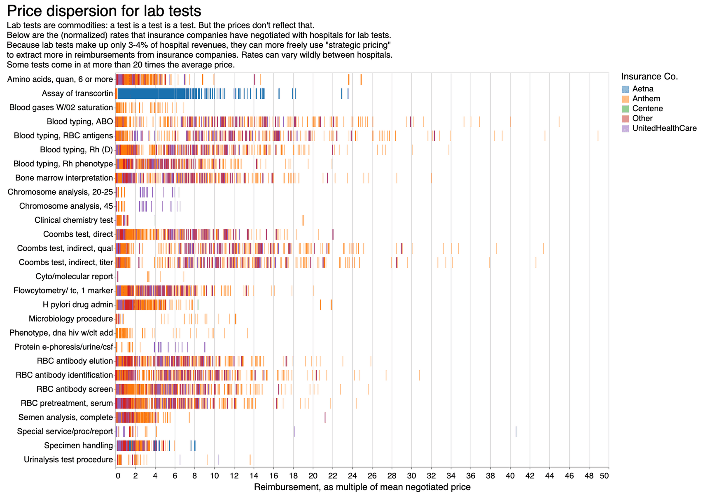

This is the weekly CEO update from [DoltHub](https://www.dolthub.com/). I'm Tim, the CEO of DoltHub. 

We made [Looker Studio Dolt's valentine](https://www.dolthub.com/blog/2023-02-13-dolt-looker/) but judging from [the video I shared last week](https://www.youtube.com/watch?v=jb2AvF8XzII&t=128s), nothing will ever top the love shared between MySQL and Git the fateful day they conceived Dolt in their Dolphin forms. Don't worry folks, I'm getting at least five more jokes out of this.

### Why are hospital lab prices so variable?

[Alec](https://www.dolthub.com/team#alec) or `@spacelove` as we call him is back at it with [one of his always interesting data analysis blogs](https://www.dolthub.com/blog/?q=alec), [this time about the lab test prices](https://www.dolthub.com/blog/2023-02-15-lab-tests/) we're collecting from [the massive health insurance price dump](https://www.dolthub.com/blog/2022-09-02-a-trillion-prices/) for the current [Quest Diagnostics bounty](https://www.dolthub.com/repositories/dolthub/quest-v4). 

### MySQL `information_schema` compatibility

We have a certain style of development at DoltHub. We are extremely responsive on our [GitHub Issues](https://github.com/dolthub/dolt). As we see patterns in issues, we identify themes and we focus on projects improving that theme. One of the themes we focused on in 2022 was "first hour experience". People were just having trouble getting Dolt to work with tools using the standard MySQL client. 

Many of these issues could be traced to Dolt not matching MySQL's `information_schema` tables. These tables are not used very often by humans but programmatic tools like SQL workbenches (ie. [Datagrip](https://www.jetbrains.com/datagrip/) or [Tableplus](https://tableplus.com/)) make heavy use of them. In December, [Jennifer](https://www.dolthub.com/team#jennifer) set out to fill in as much `information_schema` as she could. [The blog she published](https://www.dolthub.com/blog/2023-02-10-mysql-information-schema-compatibility/) shows off the results. Dolt continues to be easier to use in the first hour because of work like this. 

### Dolt and Looker Studio

I made Looker Studio Dolt's valentine. [This blog](https://www.dolthub.com/blog/2023-02-13-dolt-looker/) is a the SQL to [the Apache Superset blog](https://www.dolthub.com/blog/2023-01-27-dolt-superset/) from a few weeks ago. I think for this use case, Superset gets the rose but I'll let you be the judge.

Until next week. As always, just reply to this email if you want to chat.

--Tim
