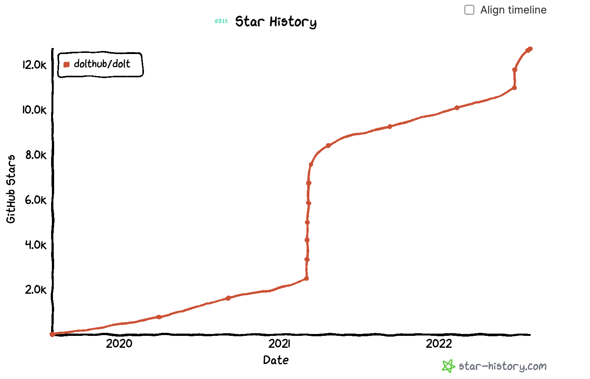

It's time for [DoltHub's](https://www.dolthub.com) CEO weekly update. 

[Last week](https://github.com/dolthub/weekly-updates/blob/main/emails/2022-07-22.md), I announced that we decided to kill automated emails and get personal. Not surprisingly, more people opened the email and read the content. Enjoy this week's update and feel free to reply.

### Dolt is a Star

[Dolt](https://www.doltdb.com) is proudly free and open source and will remain that way. Thanks to everyone who has [starred Dolt on GitHub](https://github.com/dolthub/dolt). If you haven't yet, please do. It really helps spread the word and raise money when we need to again. 

The two discontinuities are when we were high on [HackerNews](https://news.ycombinator.com/). We're currently the [~1,200 most starred repository on Github](https://gitstar-ranking.com/repositories?page=13). Let's get Dolt in the top 1,000.

### What's in the release?

We released Dolt [0.40.20](https://github.com/dolthub/dolt/releases/tag/v0.40.20). The big features in this release are the [`dolt_clone()`](https://docs.dolthub.com/sql-reference/version-control/dolt-sql-procedures#dolt_clone) and [`dolt_remote()`](https://docs.dolthub.com/sql-reference/version-control/dolt-sql-procedures#dolt_remote) procedures. [`dolt_fetch()`](https://docs.dolthub.com/sql-reference/version-control/dolt-sql-procedures#dolt_fetch), [`dolt_pull()`](https://docs.dolthub.com/sql-reference/version-control/dolt-sql-procedures#dolt_pull), and [`dolt_push()`](https://docs.dolthub.com/sql-reference/version-control/dolt-sql-procedures#dolt_push) were already implemented. The release of `dolt_clone()` and `dolt_remote()` give you full remote control from the SQL context. We're excited to see what people build using these features. 

One interesting use case we've thought of is using remotes to preserve state in the event of an unexpected error. You can save state off your production database for debugging later. Hit an edge case where the database errored in a way you don't expect? Cut a branch, set a remote, push the state of the branch to a remote for you to debug at your convenience, and finally rollback the change. We're just scratching the surface of what is possible with a [decentralized](https://www.dolthub.com/blog/2022-05-27-decentralized-database/), [version controlled](https://www.dolthub.com/blog/2021-09-17-database-version-control/) database.

### Embedded Dolt

Are you interested in using Dolt as a library, not a server? We announced the release of the [Dolt driver](https://github.com/dolthub/driver) for Golang. This allows a Golang application to access storage directly via SQL with no running server. We published [a blog](https://www.dolthub.com/blog/2022-07-25-embedded/) with some example code of how use Dolt this way. We think this is the first step in unlocking Dolt applications on mobile or in [Web Assembly (WASM)](https://webassembly.org/). If you're interested in using Dolt in this way, reply to this email or [stop by our Discord](https://discord.com/invite/RFwfYpu). We're happy to invest more here if there is interest.

### Until Next Week

Hit me up at tim@dolthub.com or just reply to this email if you have any questions or feedback. As always, the whole team and I are [on Discord](https://discord.com/invite/RFwfYpu) if you prefer to chat.