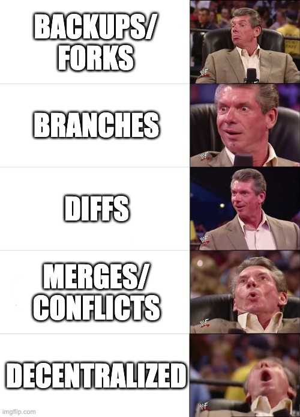

Light summer week this week. Lots of people on vacation. Here's the update.

### Dolt Use Cases

Yearly, we publish a [use cases blog](https://www.dolthub.com/blog/2022-07-11-dolt-case-studies/). 

[In 2020, the blog](https://www.dolthub.com/blog/2020-03-30-dolt-use-cases/) was aspirational, we didn't really have many real users. We just launched in September 2019. [In 2021](https://www.dolthub.com/blog/2021-03-09-dolt-use-cases-in-the-wild/), we were starting to see some real users and were refining the messaging around use cases. [This year](https://www.dolthub.com/blog/2022-07-11-dolt-case-studies/), we have a ton of cool stories to tell. If you have a use case, please let us know. You can reply to this email. We'll be sure to include your use case in next year's blog! 

### Seattle Office

[Jason](https://www.dolthub.com/team#jason) and [Zach](https://www.dolthub.com/team#zach) moved into an [office in Seattle](https://www.dolthub.com/blog/2022-08-05-dolthub-in-seattle) on Monday. I'll be making a trip up there in the next month before it starts to rain. If you're in Seattle and want to meet in person, reply to this email and I'll get you on the agenda.

### Database Versioning Survey

I published a new survey of [the database versioning space](https://www.dolthub.com/blog/2022-08-04-database-versioning/). It includes this gem about distributed version control features.

The [So you want...](https://www.dolthub.com/blog/?q=so%20you%20want) series of blogs have been great for driving search traffic to [DoltHub](https://www.dolthub.com). At some point I'll publish a blog about SEO.

Until next week...

--Tim