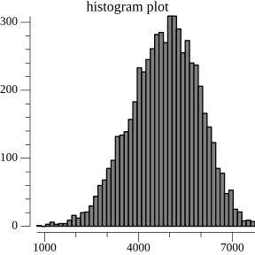

This is the weekly CEO update from [DoltHub](https://www.dolthub.com/). I'm Tim, the person who thought it was cool to name a database, [Dolt](https://www.doltdb.com), after [a term meaning "a stupid person"](https://docs.dolthub.com/other/faq#why-is-it-called-dolt-are-you-calling-me-dumb).

### It's time to migrate!

We've been working on [Dolt's new storage format](https://www.dolthub.com/blog/2022-06-27-prolly-chunker/) for over a year. This should be our last backwards incompatible format change as we prepare for our Dolt 1.0 release later this year. Look at that beautiful normal chunk size distribution! How could you not want that?

[](https://www.dolthub.com/blog/2022-08-12-new-format-migraiton/)

So, there are two supported ways [to migrate](https://www.dolthub.com/blog/2022-08-12-new-format-migraiton/) if you have the latest [Dolt version 0.40.25](https://github.com/dolthub/dolt/releases/tag/v0.40.25):

1. `dolt init --new-format` for new databases
2. `dolt migrate` for existing databases

You can check which format you are running by `dolt version`. 

```
PS C:\Users\timse\dolthub\dolt\new-format> dolt init --new-format
Successfully initialized dolt data repository.
PS C:\Users\timse\dolthub\dolt\new-format> dolt version
dolt version 0.40.25
database storage format: NEW ( __DOLT__ )
```

You see that correctly, [Dolt works on Windows](https://docs.dolthub.com/introduction/installation/windows) and I run it at home.

### Why migrate?

The [new storage format](https://www.dolthub.com/blog/2022-06-27-prolly-chunker/) comes with the exact same interface. It's the same Dolt you know and love. There is no change to the way Dolt works. 

The main benefit is of the new format is performance. We've [recently changed our benchmarks to better measure performance](https://www.dolthub.com/blog/2022-08-03-dolt-benchmarks-update/) against MySQL. The new format brings our current benchmarks [from 8.1X MySQL to 3.2X MySQL or a 2.5X increase in Dolt performance](https://www.dolthub.com/blog/2022-08-12-new-format-migraiton/#motivation).

```
+------------------------+-------+-------+----------+
|  New Format Read Tests | MySQL |  Dolt | Multiple |
+------------------------+-------+-------+----------+
| covering_index_scan    |   2.0 |  2.81 |      1.5 |
| groupby_scan           |  12.3 | 24.83 |      2.0 |
| index_join_scan        |  1.12 |  7.98 |      7.0 |
| index_scan             | 30.26 | 44.17 |      1.4 |
| oltp_point_select      |  0.15 |  0.50 |      3.3 |
| oltp_read_only         |  2.97 |  8.74 |      2.9 |
| select_random_points   |  0.30 |  0.83 |      2.8 |
| select_random_ranges   |  0.35 |  1.23 |      3.5 |
| table_scan             | 30.81 | 52.89 |      1.7 |
| types_table_scan       | 68.05 | 539.7 |      7.7 |
+------------------------+-------+-------+----------+
|   Reads Mean Multiple  |               |      3.4 |
+------------------------+---------------+----------+

+------------------------+-------+-------+----------+
| New Format Write Tests | MySQL | Dolt  | Multiple |
+------------------------+-------+-------+----------+
| bulk_insert            | 0.001 | 0.001 |      1.0 |
| oltp_delete_insert     |  2.91 | 11.04 |      3.5 |
| oltp_insert            |  1.44 |  2.91 |      1.9 |
| oltp_read_write        |  5.18 | 17.63 |      3.4 |
| oltp_update_index      |  1.44 |  4.91 |      3.0 |
| oltp_update_non_index  |  1.50 |  5.28 |      3.3 |
| oltp_write_only        |  2.22 |  8.58 |      3.8 |
| types_delete_insert    |  3.07 | 12.75 |      4.2 |
+------------------------+-------+-------+----------+
|  Writes Mean Multiple  |               |      3.0 |
+------------------------+---------------+----------+
| Overall Mean Multiple  |               |      3.2 |
+------------------------+---------------+----------+
```

This new storage engine is designed for the Online Transaction Processing (OLTP) use case. If you've been waiting to build a Dolt powered application, now is the time. Start building one using [Hosted Dolt](https://hosted.doltdb.com/).

### $12,000 Housing Prices Bounty Launch

Coming off the heels of our successful [museum collections data bounty](https://www.dolthub.com/repositories/dolthub/museum-collections) is a sequel to one of our flagship projects: tracking [every single housing sale record in existence](https://www.dolthub.com/repositories/dolthub/us-housing-prices-v2/). Start submitting Pull Requests today to earn a piece of that prize!

For this bounty, [the scoreboard](https://www.dolthub.com/repositories/dolthub/us-housing-prices-v2/bounties/6db60872-0d9a-42fb-a000-445fcbdc7c9f/scoreboard?refName=main) will reset every two weeks and we'll pay out six $2,000 bounties. Data gets progressively harder to find and collect so we think this payout method will make it worth collecting some of the hard to collect data vintages. Plus a little game theory around "Should I submit now or wait a couple weeks and risk getting sniped?" is always fun.

This bounty is in the new Dolt format so you'll need that [latest version of Dolt](https://github.com/dolthub/dolt/releases/tag/v0.40.25) to participate.

Get Migrating!

--Tim