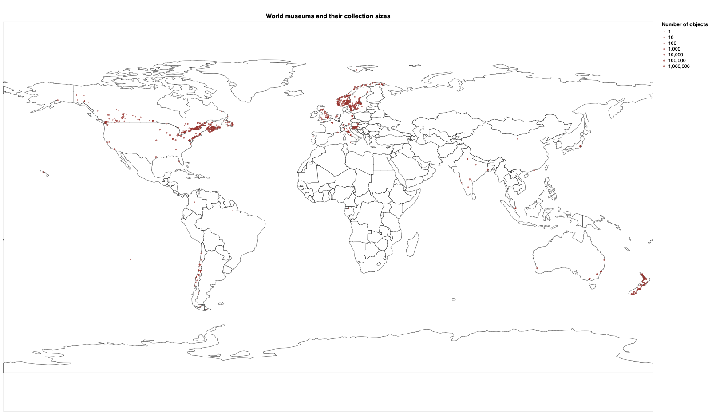

This is the weekly CEO update from [DoltHub](https://www.dolthub.com/). I'm Tim, Founder and CEO of DoltHub. In 2001, I proudly rocked a glorious [mullet](https://en.wikipedia.org/wiki/Mullet_(haircut)) for 5 days. That man (boy?) barely knows what a database is. It was simpler times.

### Dolt Fights Cancer

We finally got around to [describing our first customer's use case](https://www.dolthub.com/blog/2022-08-17-dolt-turbine/). [Turbine](https://turbine.ai/) simulates cancer cell behavior to help build cancer treatments. They use Dolt to manage multiple versions of their cancer data. Dolt improved their data quality and increased their speed of development. [Turbine's Dolt use case](https://www.dolthub.com/blog/2022-08-17-dolt-turbine/) is the example we go to to explain Dolt's value to potential customers.

We've also written customer use cases like this for [Aktify](https://www.dolthub.com/blog/2021-10-01-dolt-aktify/), who uses Dolt to ingest data into their Natural Language Processing pipeline and [Nautobot](https://www.dolthub.com/blog/2021-11-19-dolt-nautobot/), who uses Dolt to provide Git-style version control to a network configuration source of truth application.

### What's in Museums?

We concluded our [museum collections bounty last week](https://www.dolthub.com/repositories/dolthub/museum-collections). In total we collected 25.8 million objects from 1262 museums worldwide. We're pretty sure we now host the world's largest database of museum objects. We haven't started to dig into the data much, beyond [mapping it](https://www.dolthub.com/blog/2022-08-15-museums-retrospective/#stats). 

We're always happy to host guest analysis [blogs on DoltHub](https://www.dolthub.com/blog/). If you're an aspiring data scientist and are looking to build your portfolio, feel free to dig into [the data](https://www.dolthub.com/repositories/dolthub/museum-collections/data/main/objects) and [let us know](https://discord.com/invite/RFwfYpu) what you find. [This is a good example](https://www.dolthub.com/blog/2022-07-01-hospitals-compliance/) that got pretty popular.

### DoltLab: Self-Hosted DoltHub

In the Git universe, you have [GitHub](https://www.github.com) and [GitLab](https://www.gitlab.com). Over the years, their product offerings have converged but in the beginning, to me, DoltHub meant hosted, and DoltLab meant self-hosted. We brought that shorthand to [Dolt](https://www.doltdb.com), first with [DoltHub](https://www.dolthub.com), and then with [DoltLab](https://www.doltlab.com).

We [released the first version of DoltLab in January 2022](https://www.dolthub.com/blog/2022-01-14-announcing-doltlab/). It's becoming quite popular for enterprise users. Not surprisingly, putting your company's data on the internet, no matter the permissions, is just not something people are ready for just yet. I'm old enough to remember when this was the case for code as well.

Anyway, DoltLab shares the same codebase as DoltHub with billing code and other bits stripped out when we build it. This is why we can't open source it just yet. But otherwise, DoltLab is the same as DoltHub. As we improve DoltHub, DoltLab gets better too. If you were curious about Dolt and DoltHub for your enterprise use case, but were scared away by putting data on the internet, now is the time to check out [DoltLab](https://www.doltlab.com).

Until next week...

--Tim