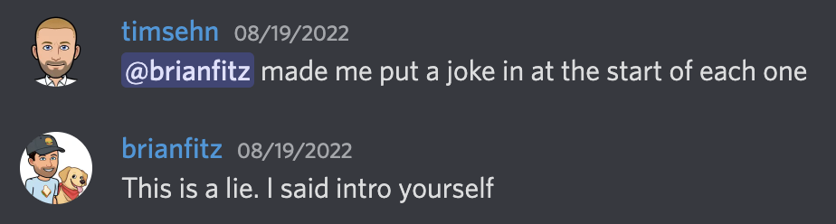
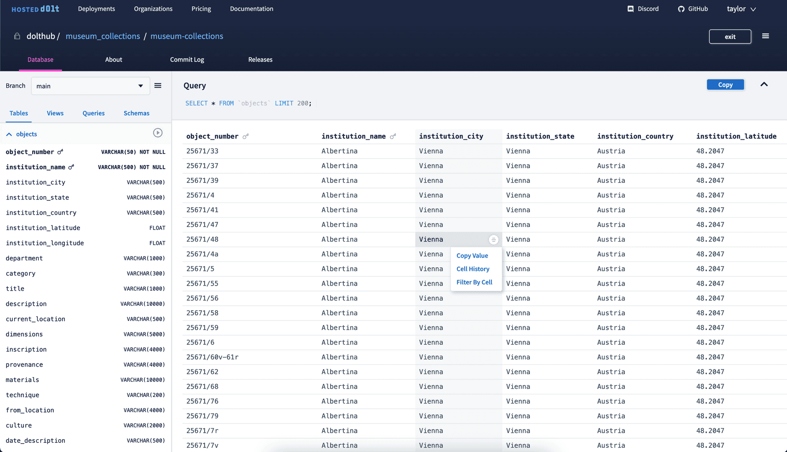

This is the weekly CEO update from [DoltHub](https://www.dolthub.com/). I'm Tim the CEO of DoltHub.

The [mullet picture](https://mailchi.mp/dolthub.com/tims-weekly-dolthub-update-n5f023c6xj) was a little contentious internally with my co-founder Brian Hendriks calling it "ridiculous". I was [instructed to make a joke by Brian Fitzgerald](https://github.com/dolthub/weekly-updates) at the beginning of every update. Brian now claims no recollection of said instruction. 

### Hosted Database UI

[Hosted DoltDB now comes with a SQL workbench](https://www.dolthub.com/blog/2022-08-24-hosted-sql-workbench/). [Hosted Dolt](https://hosted.doltdb.com/) is Dolt's answer to [Amazon RDS](https://aws.amazon.com/rds/). Click a few buttons and we'll run a Dolt server for you in AWS. The database UI is the same UI you are familiar with from [DoltHub](https://www.dolthub.com). For now, the Hosted database UI is read-only but soon, you'll be able to do writes including pull requests.

If you'd like to try it out for free, respond to this email and I'll make sure you get a demo hosted instance. You can even [`call dolt_clone()`](https://docs.dolthub.com/sql-reference/version-control/dolt-sql-procedures#dolt_clone) a [public database from DoltHub](https://www.dolthub.com/profile/discover). Because the database is online, the query experience is much snappier than DoltHub.

### Flatbuffers

My co-founder Aaron wrote a technical article about [our use of Flatbuffers](https://www.dolthub.com/blog/2022-08-22-why-we-chose-flatbuffers/) in the new storage format. If you want to understand Flatbuffers and how they compare to other serialization methods, this article is for you. Aaron alo wrote a bunch of articles about [how Dolt works generally](https://docs.dolthub.com/architecture/storage-engine#how-dolt-works-blog-series), which are really great to understand how Dolt works and why it's cool. These articles are easier to read than [the source](https://github.com/dolthub/dolt).

### Global AUTO_INCREMENT

One of the first thing astute Dolt users ask once they understand branch and merge is "How do AUTO_INCREMENT keys work? Don't those always conflict?" Our answer was "Yes. Don't use them. Use a randomly generated UUID key instead". Unfortunately that answer wasn't satisfactory for users migrating an existing application to Dolt. The application already used AUTO_INCREMENT keys and [it just needed to work](https://github.com/dolthub/dolt/issues/3373).

After thinking about it, we decided Dolt would work better if all branches on a Dolt instance share the same AUTO_INCREMENT counter. This strategy breaks down for clones but it works for the single server use case. This change is in [the latest release](https://github.com/dolthub/dolt/releases/tag/v0.40.29). It's a good illustration of the types of problems we run into building the world's first [version controlled SQL database](https://www.dolthub.com/blog/2022-08-04-database-versioning/).

Until next week.

--Tim