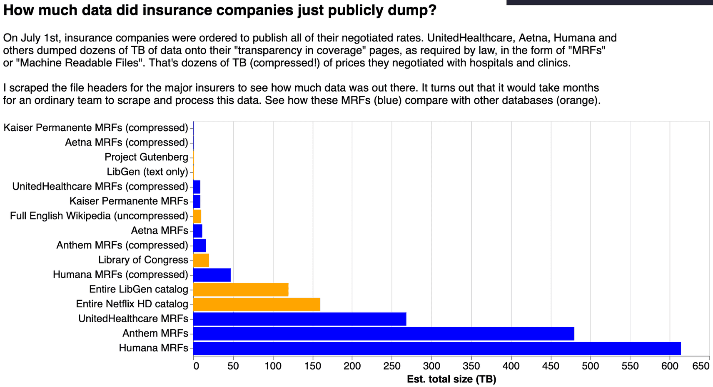

This is the weekly CEO update from [DoltHub](https://www.dolthub.com/). I'm Tim, the CEO of DoltHub.

This week we were #1 on HackerNews for the second time this summer thanks to [Alec](https://www.dolthub.com/team#alec) (aka @spacelove). Alec is our resident data scientist/bounty hunter and he lives in Queens, New York. This is a photo of him at a Manhattan night club this week.

### A Trillion Prices

Jokes aside. How in the world are there [petabytes of medical pricing information](https://www.dolthub.com/blog/2022-09-02-a-trillion-prices/)? Alec's blog went viral especially [amongst libertarian economists](https://marginalrevolution.com/marginalrevolution/2022/09/thursday-assorted-links-371.html). We're looking at this data and want to run a bounty on it. Stay tuned.

### Improved Common Table Expression (CTE) Support

### Data Diff

Until next week.

--Tim