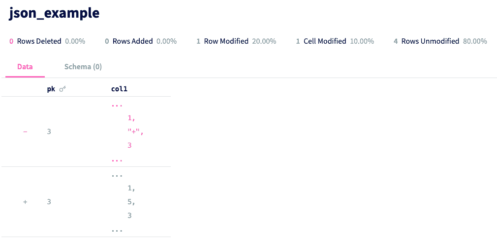

This is the weekly CEO update from [DoltHub](https://www.dolthub.com/). I'm Tim, the CEO of DoltHub. 

This email is unexpectedly JSON themed. Maybe should have saved it for Halloween? For us, nothing is scarier than killing your traditional MySQL or Postgres database with a bad transaction.

### How to use Dolt with JSON types

[Dolt](https://www.doltdb.com) supports JSON types. I [wrote a blog](https://www.dolthub.com/blog/2022-06-30-working-with-json/) a couple months back about how (and why) to use JSON types in relational databases like Dolt. We continue to add JSON type support. Just this week, we made it so you can [use `json_table()` in a join](https://github.com/dolthub/go-mysql-server/pull/1261). If you need more JSON functionality in Dolt, please [submit an issue](https://github.com/dolthub/dolt/issues).

### Better JSON/Text on DoltHub

We made [an improvement to the way we display `text` and `json` types on DoltHub](https://www.dolthub.com/blog/2022-09-21-introducing-improved-json-and-text-diffs-on-dolthub/). This change applies to both raw tables and diffs. Here at DoltHub, strategically, we've always been focused on [producing diffs fast](https://www.dolthub.com/blog/2022-09-09-data-diff/). Simply put, if you can't diff two revisions of a database fast, you can't do version control. 

But we've always thought displaying diffs was "up to the client". In the SQL context, this means that [we think of diffs as queryable](https://www.dolthub.com/blog/2020-04-24-using-dolt-to-find-test-regressions/). Once we produce them, it's up to the user to display them. But, we have two main clients we own, the Dolt CLI and [DoltHub](https://wwww.dolthub.com). On DoltHub, we have the full power of a modern web application to create great user interfaces. I think we've done that with the new JSON diff functionality.

### Small change. Big Win.

I'm often amazed when a one line code change makes a big difference. We had one of these in the last release. For background, we broke out `blob`, `text`, and `json` types into their own `sysbench` tests because both Dolt and MySQL store these objects as blobs on disk – a pointer is stored in the table, not the object itself. We created a new `sysbench` test that measures performance of these types called `types_table_scan`. This test was running at about [9X MySQL in 0.41.4](https://github.com/dolthub/dolt/releases/tag/v0.41.4) in the [new `__Dolt__` format](https://www.dolthub.com/blog/2022-09-19-new-format-dolthub/) I've been nattering on about. 

[In the latest Dolt, 0.41.5](https://github.com/dolthub/dolt/releases/tag/v0.41.5), performance has improved to 3.2X MySQL, almost three times faster. That must have been months of engineering effort? Nope. No. Nah. [One line](https://github.com/dolthub/go-mysql-server/pull/1270). It turns out not having to rebuild the context for every parse of a JSON object saves a lot of work.

--Tim
