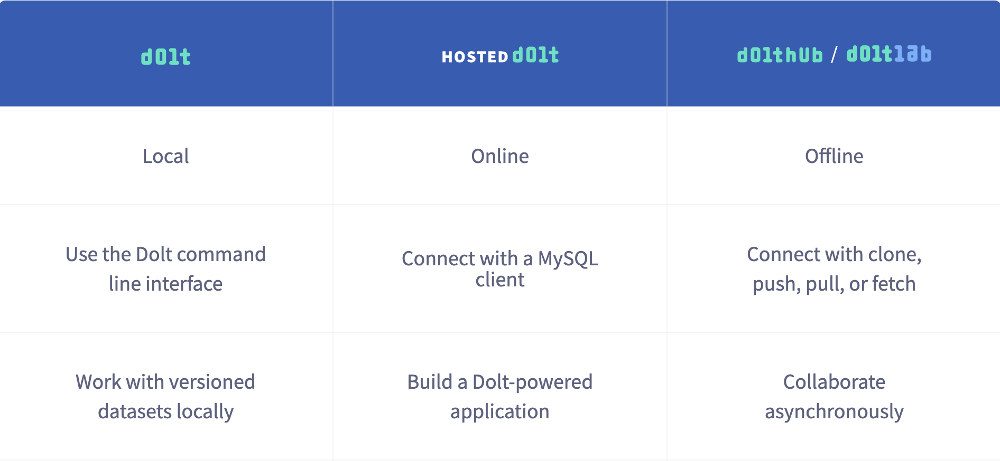

This is the weekly CEO update from [DoltHub](https://www.dolthub.com/). I'm Tim, the CEO of DoltHub. 

{Joke. Maybe Canada joke?}

### New Format is the Default

I know. I know. You're tired of hearing about this. Problem is, we have to get everyone migrated to the new format. It's just better. It's [faster]() and [has fewer bugs](https://github.com/dolthub/dolt/issues/4419). We're starting to get people asking [why it's not the default already](https://github.com/dolthub/dolt/issues/4419#issuecomment-1261527471)! Sorry Kyra.

The new format is now the default [on DoltHub](https://www.dolthub.com/blog/2022-09-19-new-format-dolthub/) and [in Dolt](https://docs.dolthub.com/sql-reference/benchmarks/latency) for new databases. You can migrate an old format database using `dolt migrate`. A migrate button on DoltHub is coming soon, hopefully by Friday next week. Like Canada Geese, start migrating to the warmer new format for the winter.

### Hosted Just Keeps Getting Better

Pull Requests on Hosted. 

{Discuss shift from DoltHUb as your hub to Hosted as your hub}

### Dolt How To

[When to make a Dolt Commit](https://www.dolthub.com/blog/2022-09-28-when-to-dolt-commit/)
[How to Rollback in Dolt](https://www.dolthub.com/blog/2022-09-23-dolt-rollback-options/)
[Getting Started with Permissions](https://www.dolthub.com/blog/2022-08-19-dolt-permissions-introduction/)
[Getting Started](https://www.dolthub.com/blog/2022-06-13-version-controllled-database-getting-started/)

Until next week. As always, just reply to this email if you want to chat.

--Tim
