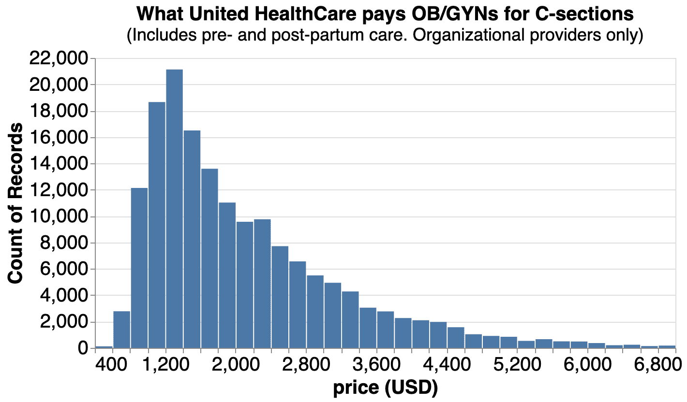

This is the weekly CEO update from [DoltHub](https://www.dolthub.com/). I'm Tim, the CEO of DoltHub. 

In this email we mostly discuss [data bounties](https://www.dolthub.com/bounties). [Bounty hunters hold a special place in popular culture](https://en.wikipedia.org/wiki/Category:Fictional_bounty_hunters). You got [the Mandalorian](https://en.wikipedia.org/wiki/The_Mandalorian), [Dog](https://en.wikipedia.org/wiki/Duane_Chapman), and even [Metroid](https://en.wikipedia.org/wiki/Samus_Aran). I wonder if we'll ever be adding data bounty hunters to this list?

### Hospital Price Data for C-Sections

Last month, [we wrote about the massive size of medical prices published by insurance companies](https://www.dolthub.com/blog/2022-09-02-a-trillion-prices/). Not to be denied, we [wrote and open sourced a streaming parser for these files](https://github.com/dolthub/data-analysis/tree/main/transparency-in-coverage/python/processors).

The result is [a case study in C-section prices](https://www.dolthub.com/blog/2022-10-03-c-sections/) as reported by United Healthcare. Check it out if your interested in healthcare and data analysis.

We will continue as long as we can to champion open data as a force for good.

### Why Data Bounties?

It's been [almost two years since we launched our first data bounty](https://www.dolthub.com/blog/2020-12-16-data-bounties/). We're currently on the last leg of our second [US Housing Prices Bounty](https://www.dolthub.com/repositories/dolthub/us-housing-prices-v2). This data has been used to build some pretty great analysis, [in grab bag form](https://www.dolthub.com/blog/2022-03-11-housing-prices-what-we-learned/) and then [a deep analysis of what markets were driving housing inflation](https://www.dolthub.com/blog/2022-04-13-many-faces-of-housing-market/). If you're looking to make a bit of money scraping and wrangling data in service of the open data cause, bounties are for you.

If you're a regular reader of this email, you can probably tell DoltHub is a database company. Most of our time an d effort goes into trying to make [Dolt the next great relational database](https://github.com/dolthub/dolt). Data Bounties may seem like a distraction to that mission. So, why do we continue to do bounties? We started DoltHub because we wanted a place on the internet to get access to interesting, maintained data. We thought if we added branch/merge like we had in source code to data in some way, more data would be shared. Data bounties are the ultimate in branch/merge. Random strangers from all over the internet collaborating to build useful, open data. Bounties are inspiring for us and our potential customers. We hope they inspire you.

### Welcome Pavel to the Seattle Office

Our [Seattle office](https://www.dolthub.com/blog/2022-08-05-dolthub-in-seattle/) is growing. [Pavel](https://www.dolthub.com/team#pavel) started on Monday. The core [Dolt product](https://www.doltdb.com) will mostly be built out of Seattle with Santa Monica covering [DoltHub](https://www.dolthub.com), [DoltLab](https://www.doltlab.com), and [Hosted Dolt](https://hosted.doltdb.com). We have a couple spots still available. If you're interested, please [apply on LinkedIn](https://www.linkedin.com/jobs/view/3261490084/).

Until next week. As always, just reply to this email if you want to chat.

--Tim
