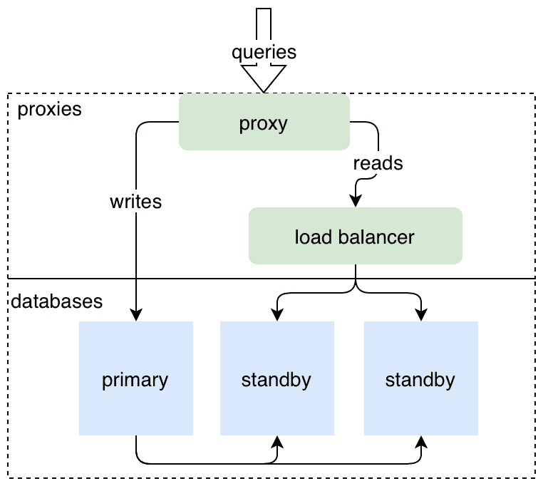

This is the weekly CEO update from [DoltHub](https://www.dolthub.com/). I'm Tim, the CEO of DoltHub. 

We're big fans of [CockroachDB](https://www.cockroachlabs.com/). We've referenced their open source SQL engine work a lot in [Dolt](https://www.doltdb.com). This week they talked about [the CAKE stack](https://thenewstack.io/have-some-cake-the-new-stateful-serverless-stack/):

**C**ockroachDB
**A**uthorization, authentication, session and user management
**K**ubernetes
**E**vent-driven serverless platforms

Honestly, this is some weak acronym play compared to the classics [JAM](https://en.wikipedia.org/wiki/Jamstack), [MERN](https://www.mongodb.com/mern-stack), or the OG, [LAMP](https://en.wikipedia.org/wiki/LAMP_(software_bundle)). But it got us thinking what would be a good Dolt stack. After some clever word play, the people who brought you Dolt give to you the DORK stack!

**D**olt
**O**RM
**R**eact
**K**ubernetes

This stack powers the [Hosted Dolt])(https://hosted.doltdb.com) website. Have a better one? Reply to this email and I'll shout it out next week.

### Introducing Standby Replication

We released a new form of replication this week: [standby replication](https://www.dolthub.com/blog/2022-10-19-standby-replication/). This allows you to configure a number of Dolt servers in a cluster and fail over between them. We now have two forms of replication, standby and [remote-mediated](https://docs.dolthub.com/sql-reference/server/replication). Standby is best for failover and remote-mediated is best for scaling for read load. We'll soon have this available for [Hosted Dolt](https://hosted.doltdb.com) customers but if you run your own Dolt, have at it. We continue to drive towards making [Dolt a world class OLTP database](https://www.dolthub.com/blog/2021-06-14-dolt-is-a-database/).

### 

### How can you support us?

More an more, people love what we're doing and ask how we make money. The dirty little secret is, as with most start ups, we don't make much money. Looking at how similar big companies make most of their money, there are two potential businesses for us in the long run, enterprise DoltHub/DoltLab or Hosted Dolt. Maybe we'll invent a new big business in the database space but that's unlikely. 

In the short run, we have a bunch of ways you can support us. Here's a list from cheapest on up.

1. **Free** - Use the product. Run a Dolt database and share it with your teammates on DoltHub or DoltLab.
2. **Free** - Cut [GitHub Issues](https://github.com/dolthub/dolt/issues) for bugs you find or improvements you want.
3. **Free to start** - Sign up fir DoltHub Pro. You'll pay $50/month after you have over 1GB of databases on DoltHub.
4. **Any Amount** - [GitHub sponsor the DoltHub organization](https://github.com/sponsors/dolthub).
5. **$50/month and up** - Deploy a [Hosted Dolt](https://hosted.doltdb.com) Instance. Build a production application on it.
6. **$5,000/month** - Buy support for Dolt, DoltHub, DoltLab and all our other products. This price is negotiable depending on your support needs.

Until next week. As always, just reply to this email if you want to chat.

--Tim
