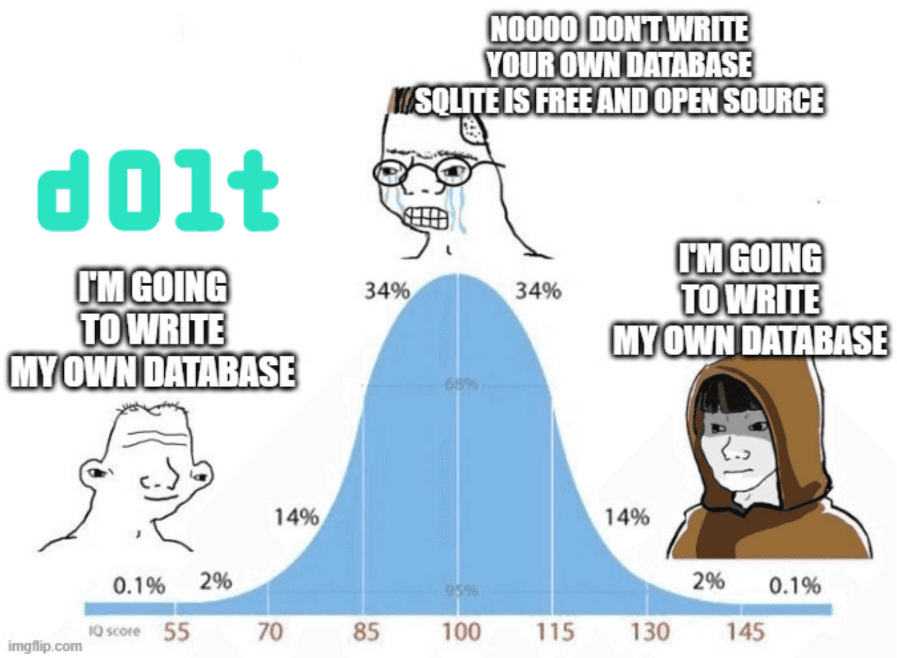

This is the weekly CEO update from [DoltHub](https://www.dolthub.com/). I'm Tim, the CEO of DoltHub. 

It has come to my attention that some of you thought I dropped the joke [last week](https://mailchi.mp/dolthub.com/tims-weekly-dolthub-update-n5f023c6xj-9196731). The DORK stack was the joke! The people that brought you the Dolt database now bring you the DORK stack. Come on people. Work with me here. [As I said](https://mailchi.mp/dolthub.com/tims-weekly-dolthub-update-n5f023c6xj-9179619), I'm not funny.

### Practical Golang Blog Series

[Zach](https://www.dolthub.com/team#zach) published a [Go Performance Case Studies blog](https://www.dolthub.com/blog/2022-10-14-golang-performance-case-studies/) a couple weeks ago, inspired by his talk at Gophercon. The blog was picked up in a few places but I did not mention it here. It features this great meme.

Golang blogs always do well and drive interest in Dolt. We're going to publish a Practical Golang article every 3 to 4 weeks. Stay tuned.

### New $10,000 Bounty: Hospital Chargemaster URLs

We're working with [Payless.Health](https://payless.health/) on this one. This time we're going after [hospital chargemaster URLs](https://www.dolthub.com/repositories/onefact/paylesshealth). We've already run a [few bounties](https://www.dolthub.com/profile/discover?q=hospital-price-transparency) on this data. See [the launch blog](https://www.dolthub.com/blog/2022-10-28-announcing-hospital-urls/) for more details. Happy hunting.

### Dolt on DockerHub

Dolt is really easy to install. People still wanted a canonical Docker image. Me, a [crotchety old Linux neckbeard](https://www.google.com/search?q=neckbeard), "Dolt is a single file. Download it and put it in your `PATH`. Ugh." People were confused. So, we made a [docs page](https://docs.dolthub.com/introduction/installation/docker) with sample Docker files. But people [kept asking for a canonical image](https://github.com/dolthub/dolt/issues/1897).

Well, you broke me. Finally, we have two images on [DoltHub's DockerHub](https://hub.docker.com/u/dolthub), [one for the Dolt command line](https://hub.docker.com/r/dolthub/dolt) and [one for a Dolt SQL Server](https://hub.docker.com/r/dolthub/dolt-sql-server). The Dolt SQL Server image is modeled after MySQL's Docker image. [Jennifer](https://www.dolthub.com/team#jennifer) even wrote [a How To](https://www.dolthub.com/blog/2022-10-26-publish-releases-on-dockerhub/) if anyone wants to use GitHub Actions to publish to DockerHub. I will now return to my basement to play Civ6.

Until next week. As always, just reply to this email if you want to chat.

--Tim
