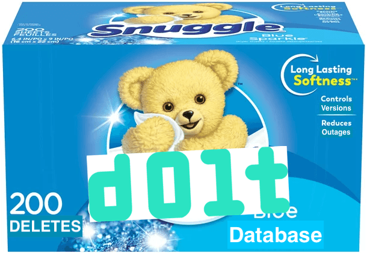

This is the weekly CEO update from [DoltHub](https://www.dolthub.com/). I'm Tim, the CEO of DoltHub. 

### Time to Plug New Format Again!

[DoltHub has a migrate button!](https://www.dolthub.com/blog/2022-11-01-dolthub-migrate-button/). It's on the Settings page of your DoltHub database. Do me one favor and go press it for your databases. 

Pressing the button migrates your DoltHub database on a worker host and then swaps out the old format database for the new one. You'll have to re-clone or migrate your local copy after the job is done. This is about as easy as migrating is going to get. 

For those of you that are new, we spent the year building [a new Dolt storage format](https://www.dolthub.com/blog/2022-06-27-prolly-chunker/). It's [faster](https://www.dolthub.com/blog/2022-09-30-new-format-default/), less buggy, and we're going to eventually deprecate the old format. Help us out and migrate. We want to delete the old code.

### More Hospital Price Transparency Work

[Alec](https://www.dolthub.com/team#alec), aka @spacelove, has been hard at work [building tools](https://github.com/dolthub/data-analysis/tree/main/transparency-in-coverage) to help with [the massive health insurance company data drop](https://www.dolthub.com/blog/2022-09-02-a-trillion-prices/). This week he published [a great explainer and how to](https://www.dolthub.com/blog/2022-11-02-parsing-mrfs-with-ijson/) on his streaming parser. You too can investigate healthcare prices. Read his blog and follow along with the helpful example. Then swap in a procedure code other than dialysis. 

### Use Dolt for Soft Deletes

Dolt is the best choice of database if you use the [soft delete](https://en.wiktionary.org/wiki/soft_deletion) pattern. I wrote a [blog on the topic](https://www.dolthub.com/blog/2022-11-03-soft-deletes/) but I really just want everyone to see this picture I made. I'm proud of it.

Until next week. As always, just reply to this email if you want to chat.

--Tim
