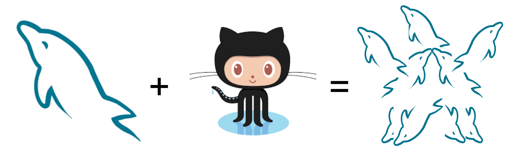
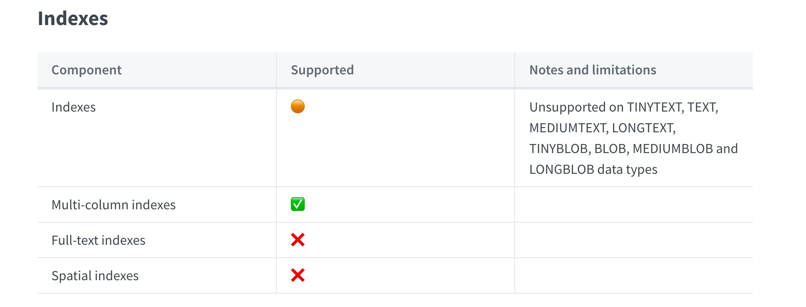

This is the weekly CEO update from [DoltHub](https://www.dolthub.com/). I'm Tim, the CEO of DoltHub. 

We've found that the best to describe Dolt is: It's like Git and MySQL had a baby. I often wonder what a mascot for such a thing would look like. MySQL is a Dolphin. GitHub is an Octocat. Is Dolt an Octodolphin?

[](https://www.doltdb.com)

Who needs designers? THe new Dolt logo is perfect.

### Dolt now supports every MySQL type

Some of you may know, we have a [whole section of our documentation on MySQL compatibility](https://docs.dolthub.com/sql-reference/sql-support). The documentation is divided into sections regarding SQL features like indexes, functions, and schema. If Dolt matches MySQL functionality, we put a green checkmark in the table. If we mostly match, we either put a caveat in the third column, or mark it yellow instead of check. Finally, if we don't support it, we put the dreaded red x. Here is an example.

[](https://docs.dolthub.com/sql-reference/sql-support/data-description)

Dolt's goal is 100% MySQL compatibility. That is the easiest for customers. If code works on MySQL, it works on Dolt. If a tool works on MySQL, it works on Dolt. Only add the version control pieces you want to take advantage of Dolt's unique features. To get there all these tables need to be all green checkmarks.

A couple weeks ago, we turned an entire table green checkmark, [the types table](https://docs.dolthub.com/sql-reference/sql-support/data-description#data-types)! I know to you all, you are like "cool story". But to us, we started Dolt with no SQL support. We hand-crafted our own SQL engine before we found [go-mysql-server](https://github.com/dolthub/go-mysql-server), ie. GMS. When the company supporting GMS went out of business we took over support for their open source project. We've spent three years improving it. I'm really happy we got our first. This has been a journey and this feels like a nice oasis to stop at and reflect.

The last types we needed to support were "MultiGeometries". [Read about those here](https://www.dolthub.com/blog/2022-11-09-dolt-supports-every-type/).

As always, if you need a SQL feature we don't support, please [cut an GitHub issue](https://github.com/dolthub/dolt/issues). We are very responsive.

### Dolt lost some weight

We noticed that people like it when [we write about Golang](https://www.dolthub.com/blog/?q=golang). So, we're going to do it more. 

Our [latest](https://www.dolthub.com/blog/2022-11-07-pruning-test-dependencies-from-golang-binaries/) is the kinda not worth it week long adventure [Zach](https://www.dolthub.com/team#zach) went on to find out why our test dependencies were being included in the Dolt binary we ship. Well, he found it, cut Dolt size by 8MB to 66MB, and we got a [blog post](https://www.dolthub.com/blog/2022-11-07-pruning-test-dependencies-from-golang-binaries/).

```
$ du -h /Users/timsehn/go/bin/dolt
 66M	/Users/timsehn/go/bin/dolt
 ```

Enjoy the new fit and trim Dolt personal trainer Zach whipped into shape. We're still not sure it was worth the week of engineer effort.

### Hosted $50/month instance

You can get started with [Hosted Dolt](https://hosted.doltdb.com/) for [$50/month](https://www.dolthub.com/blog/2022-10-24-hosted-trial-instances/) billed hourly. We launched a trial instance type that we think is perfect for demoing. Spin one up for a few hours and see if the Hosted version of Dolt is right for you.

Until next week. As always, just reply to this email if you want to chat.

--Tim
