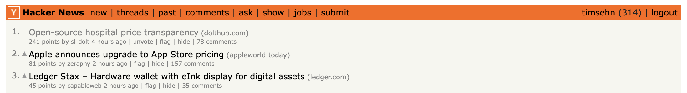
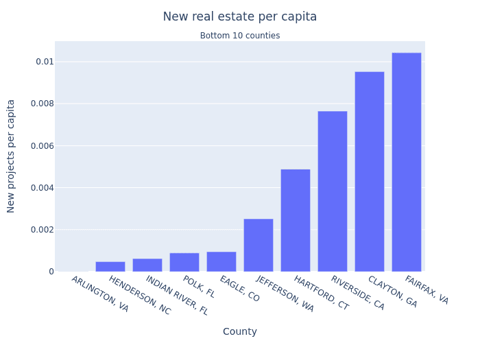

This is the weekly CEO update from [DoltHub](https://www.dolthub.com/). I'm Tim, the CEO of DoltHub. 

This is becoming an evergreen meme around DoltHub HQ.

Keep up the great work [`@spacelove`](https://www.dolthub.com/team#alec)!

### Stored Procedure Improvements

[Daylon](https://www.dolthub.com/team#alec) [improved stored procedures](). Here at DoltHub, we [manage by blog post](https://www.dolthub.com/blog/2021-07-02-manage-by-blog-post/). Daylon was only going to variables and cursors but as he started writing his blog, he realized his customer focused examples were lame without loops and handlers. So, you got all those features and a better blog. Everyone wins! Except maybe Daylon who had to work harder to get this done.

### Cooperating with Golang's Garbage Collector

Continuing our Golang blog post series, [Max](https://www.dolthub.com/team#max) wrote about [cooperating with Golang's Garbage Collector](https://www.dolthub.com/blog/2022-12-05-blob-writing-perf/) to improve our blob import performance. Even better, blob imports are faster now. Blobs include includes `TEXT` and `JSON` columns. 

### NIMBY vs YIMBY Counties in the US

Thanks to Rimanatas Lukosevicius, a guest blog contributor, who used our open [US Housing Prices database](https://www.dolthub.com/repositories/dolthub/us-housing-prices-v2) to identify [YIMBY and NIMBY counties in the US](https://www.dolthub.com/blog/2022-12-08-nimby-yimby/). 

If you are interested in being a guest data scientist on our blog, reply to this email.

Until next week. As always, just reply to this email if you want to chat.

--Tim