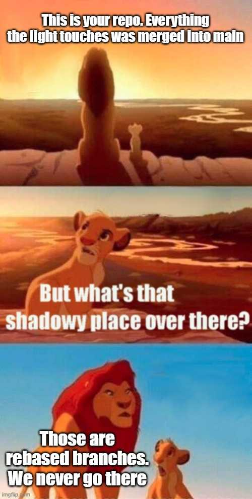

This is the weekly CEO update from [DoltHub](https://www.dolthub.com/). I'm Tim, the CEO of DoltHub. 

This is likely your last email of 2022. Here at DoltHub, we get the next two Fridays off so I ain't writing jokes. I'll have a 3X better joke, January 6, 2023.

### Prefix Indexes

We launched [prefix indexes](https://www.dolthub.com/blog/2022-12-09-prefix-indexes/) last week. You know, the ones that l;ook like this:
```
mysql> alter table txt_tbl_idx add index (t(6));
```
Prefix indexes add an index to the first N bytes of your strings or blobs so you can look them up faster.

### A Wordcels Guide to Git

[roon](https://twitter.com/tszzl) popularized the [Wordcel vs Shape Rotator meme](https://knowyourmeme.com/memes/wordcel-shape-rotator-mathcel) a few months back. [Zach](https://www.dolthub.com/team#zach), of meme-filled blog fame, immediately made everyone in our office take a side. Zach hung the Wordcel flag having an English degree and all. 

Well, he's back applying this deep understanding of the Wordcel/Shape Rotator meme to a topic we here at Dolt know a lot about, [the Git commit graph](https://www.dolthub.com/blog/2022-12-14-wordcels-guide-to-git/). It contains this gem about rebase which I really enjoyed.

[](https://www.dolthub.com/blog/2022-12-14-wordcels-guide-to-git/)

### This email is a blast

Thanks to all of you who haven't unsubscribed. I started writing these weekly updates in July on a bit of a lark. I get about one, usually positive, reply per week. As always, if you want to chat, just reply. I run inbox zero so I'll get it. It's been great connecting with you more personally and sharing our progress every week. We're on a mission to build a world where data is more open, reliable and easier to share. Thanks for joining us on that mission by following and hopefully, using Dolt. It's a real version controlled SQL database now!

Until next week. As always, just reply to this email if you want to chat.

--Tim
