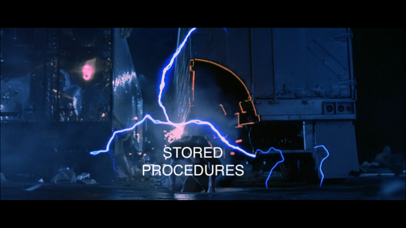

This is the weekly CEO update from [DoltHub](https://www.dolthub.com/). I'm Tim, the CEO of DoltHub. 

[Daylon](https://www.dolthub.com/team#daylon) called me a boomer this week because I made this featured image for [his CALL AS OF blog](https://www.dolthub.com/blog/2023-01-18-unlocking-time-travel/).

He went with this stock image instead.

It hurt my feelings so I'm letting you all be the judge. Reply to this email with your thoughts. Who is right here? Me or Daylon?

### CALL ... AS OF

We think Dolt can be the best database for stored procedures. Stored procedures are code stored in your database. Most engineers think versioning code is a must. So versioning the code in your stored procedures makes a lot of sense. 

In service of the above, this week [we announced the release of `CALL...AS OF`](https://www.dolthub.com/blog/2023-01-18-unlocking-time-travel/). For those of you that don't know, you can [SELECT AS OF branch, commit, or even timestamp](https://docs.dolthub.com/sql-reference/version-control/querying-history#querying-past-snapshots-with-as-of). It's on of the most powerful features of Dolt allowing you to time travel between different versions of your Dolt database in a single query. For instance, you can [rollback a specific column to a commit using an update join with as of](https://www.dolthub.com/blog/2022-09-23-dolt-rollback-options/#partial-rollback-using-sql).

This release extends that functionality to stored procedures. You can have an old version of a stored procedure operate on current data or the current version of a stored procedure operate on an old version of the data. Read [the release blog](https://www.dolthub.com/blog/2023-01-18-unlocking-time-travel/) to find out more.

### Getting Started: Git For Data

Last June, I published a [Getting Started: Version Controlled Database](https://www.dolthub.com/blog/2022-06-13-version-controllled-database-getting-started/) blog that quickly became [Dolt's GitHub README](https://github.com/dolthub/dolt).

Our [Git for Data Getting Started documentation](https://docs.dolthub.com/introduction/getting-started/git-for-data) felt a bit lacking. Dolt is Git for Data! Our blog and documentation should hype that use case as well. So I published a [Getting Started: Git for Data blog]() that I think does that use case justice.

### Quest Data Bounty

This January, we've been running [a bounty](https://www.dolthub.com/repositories/dolthub/quest-small) to collect certain lab prices from [the massive health insurance data dump](https://www.dolthub.com/blog/2022-09-02-a-trillion-prices/) for [Quest Diagnostics](https://www.questdiagnostics.com/). We're on the third leg of the bounty and we think we've found [a great compressed schema](https://www.dolthub.com/blog/2023-01-11-mrf-data-deduplication/). If you have been curious about bounties but haven't tried one, [this is one of the easier bounties to get started on](https://www.dolthub.com/repositories/dolthub/quest-small).

Until next week. As always, just reply to this email if you want to chat.

--Tim
