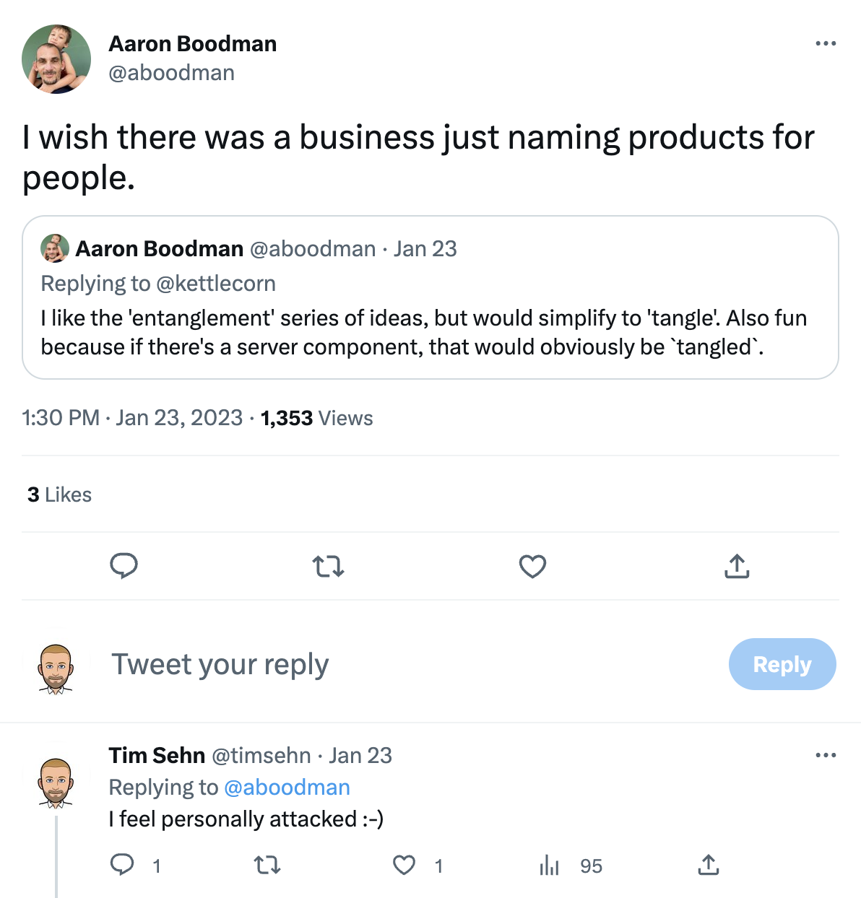
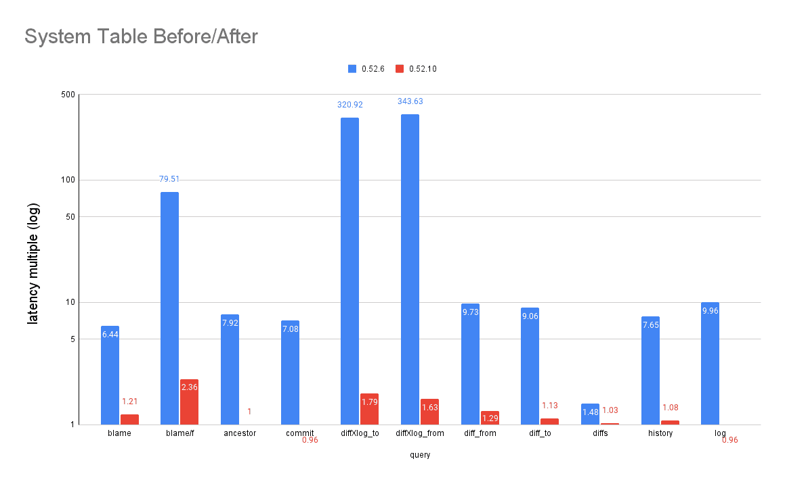

This is the weekly CEO update from [DoltHub](https://www.dolthub.com/). I'm Tim, the CEO of DoltHub. 

Many thanks to Aaron Boodman and the rest of the [Noms](https://github.com/attic-labs/noms) team. We wouldn't be here without you. Aaron and I talk every once is a while, either on [our Discord](https://discord.com/invite/RFwfYpu) or via Twitter. We had this interaction this week.

Yes. I'm the man who thought it was ok to name a database after ["a stupid person"](https://www.merriam-webster.com/dictionary/dolt).

### MySQL Binlog Replication Preview

Alright folks, I'm really excited about this one. Have you been interested in Dolt but didn't have a use case? Are you having trouble convincing people to run a pre-1.0 database in production? Is Dolt just too hard to get started with? We have a solution!

[Jason](https://www.dolthub.com/team#jason) has a preview version of `binlog` replication from MariaDb or MySQL to Dolt. Turn it on and every transaction commit on your production MySQL instance becomes a Dolt commit on the Dolt replica. You get an audit log of every cell, time travel, and branch for development on a replica. No risk to production. Dolt features at almost zero cost. Imagine how much easier life would have been at [Atlassian](https://www.dolthub.com/blog/2022-04-14-atlassian-outage-prevention/) if they had one of these.

Respond to this email if you want to be part of the preview. We're really excited for people to try it out.

### Dolt System Table Performance Improvements

[Max](https://www.dolthub.com/team#jason) made [dramatic improvements in Dolt system table performance](https://www.dolthub.com/blog/2023-01-23-32-system-table-indexes/) by adding custom indexes on the commit fields. The [technical deep dive](https://www.dolthub.com/blog/2023-01-23-32-system-table-indexes/) here is almost as cool as the results. Read it but more importantly read the [Dolt system tables](https://docs.dolthub.com/sql-reference/version-control/dolt-system-tables). You can now read more per unit time.

### Online Garbage Collection

Dolt can make a lot of disk garbage. [Taylor](https://www.dolthub.com/team#taylor) has been working on [making garbage collection accessible from the SQL context](https://www.dolthub.com/blog/2023-01-25-online-gc/) with the goal of having that process run automatically in the background. We're half way there with the [`call dolt_gc()` stored procedure](https://docs.dolthub.com/sql-reference/version-control/dolt-sql-procedures#dolt_gc). 

Again, reply if you want to try binlog replication. We're really excited about it. Until next week.

--Tim
