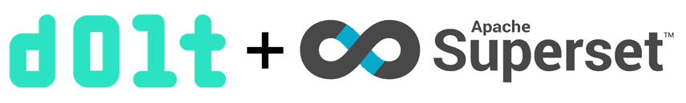

This is the weekly CEO update from [DoltHub](https://www.dolthub.com/). I'm Tim, the CEO of DoltHub. 

I'm the wise old age of 43 today. Maybe if I was starting this company today, I would be wise enough not to name it the hub of stupid people. Probably not.

### Dolt + Superset

I published a blog post on [how to add versioning to your dashboarding](https://www.dolthub.com/blog/2023-01-27-dolt-superset/) using Dolt and [Apache Superset](https://github.com/apache/superset).

Branches can power different datasets in Superset allowing easy comparison all with the auditing capabilities of Dolt backing it all up. I go through a faulty DAU and MAU metrics scenario in [the blog](https://www.dolthub.com/blog/2023-01-27-dolt-superset/) that happened to me a few times in my previous job.

### Embedding Go in C

[Daylon](https://www.dolthub.com/team#daylon) wrote a [great blog](https://www.dolthub.com/blog/2023-02-01-embedding-go-in-c/) and [sample application](https://github.com/dolthub/go-library-sample) explaining how to embed Golang code in a C application. 

This is especially important to us for the [embedded use case](https://www.dolthub.com/blog/2022-07-25-embedded/) where you use Dolt in your application without a running server. Right now, [that's easy to do in Golang](https://www.dolthub.com/blog/2022-07-25-embedded/) but we want to be able to do it in every language, a la [SQLite](https://sqlite.org/index.html). We think the offline first, online sync capabilities of Dolt make a lot of sense in some SQLite use cases. Let us know if that is you by replying to this email.

### Binlog Replication Preview

I did not get a single reply to [last week's email pitch on binlog replication](https://mailchi.mp/dolthub.com/tims-weekly-dolthub-update-c2e18x7n0u-9291563). This one is cool and important. I will not be denied. Let me tell you again.

[Jason](https://www.dolthub.com/team#jason) has a preview version of binlog replication from MariaDb or MySQL to Dolt. Turn it on and every transaction commit on your production MySQL instance becomes a Dolt commit on the Dolt replica. You get an audit log of every cell, time travel, and branch for development on a replica. No risk to production. Dolt features at almost zero cost. Imagine how much easier life would have been [at Atlassian](https://www.dolthub.com/blog/2022-04-14-atlassian-outage-prevention/) if they had one of these.

We need people to help test it with us. You just configure a Dolt replica in the same way you would a MySQL replica. Reply to this email if you want to help. Pretty please. Next week I'm coming back with an image if I don't get a reply.

Until next week. As always, just reply to this email if you want to chat.

--Tim
