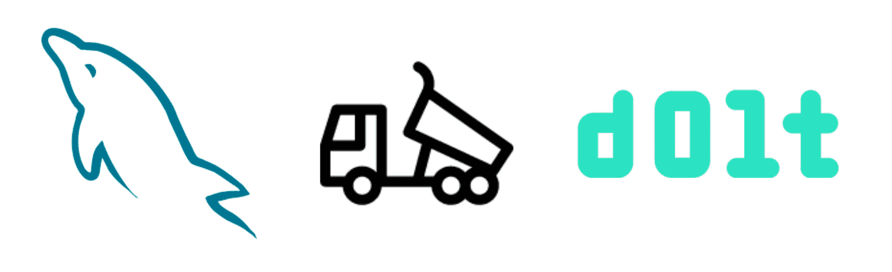

This is the weekly CEO update from [DoltHub](https://www.dolthub.com/). I'm Tim, the CEO of DoltHub. 

This week, we had [an iconic video](https://www.youtube.com/watch?v=jb2AvF8XzII&t=128s) feature us as one of the 15 future databases. Thanks [Fireship](https://www.youtube.com/@Fireship)! For this week's joke, I'm just going to ask [you watch the first 5 seconds of the video](https://www.youtube.com/watch?v=jb2AvF8XzII&t=128s). Fireship is funnier and more daring than I could ever be in this email.

### Dolt for Backups

Astute reader will notice a lot more content focused on how and why to use Dolt. We've done a good job building a great product people are interested in.But we haven't done a good enough job explaining how and why to use it. We're making a concerted effort to change that this year, starting with written blogs, because that's what we're best at.

In service of the above theme, we have [Dolt for Backups](). This could have been called Dolt your dumps but that was a way worse title. This article explains some of the features you get using a detailed example if you store a copy of your MySQL dumps in Dolt. Like [the binlog replication](https://www.dolthub.com/blog/2022-12-16-coming_soon_binlog_replication/) I've been touting, this is purely additive, you cans still run MySQL. Get time travel, and audit log of every cell, and the ability to clone for development just by sticking a copy of your dumps in Dolt.

### Dolt for Game Development

And again with how and why, this time by [Zach](https://www.dolthub.com/team#zach) about using Dolt in game development. We have a couple game development customers and it has really streamlined their development process. Dolt allows you to treat game configuration like code and test it on branches. This blog shows you how.

### Semi and Anti Join Support

Finally, [Dolt now supports semi and anti joins](https://www.dolthub.com/blog/2023-02-03-subquery-unnesting/). This is a SQL analyzer optimization. [Max](https://www.dolthub.com/team#max) explains when semi and anti joins are needed and how they improve Dolt performance in those cases. 

We continue to iterate on our SQL engine, [`go-mysql-server`](https://github.com/dolthub/go-mysql-server). It's free and open source as well. We're using it to build a new MySQL compatible database on top of a custom storage engine. But most people use it for MySQL testing in Golang without a running MySQL. Anyway, [throw it a GitHub star](https://github.com/dolthub/go-mysql-server) if you have a chance.

Until next week. As always, just reply to this email if you want to chat.

--Tim
