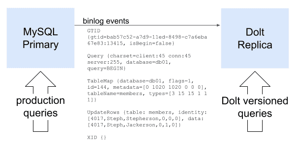
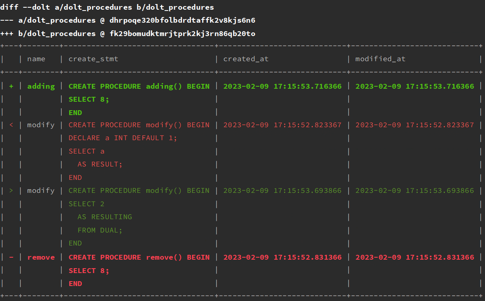

This is the weekly CEO update from [DoltHub](https://www.dolthub.com/). I'm Tim, the CEO of DoltHub. 

[You have been a bad user. I have been a good Dolt.](https://www.theverge.com/2023/2/15/23599072/microsoft-ai-bing-personality-conversations-spy-employees-webcams). Read this weekly update.

### Binlog Replication Launch

[Setting up Dolt as a replica](https://www.dolthub.com/blog/2023-02-17-binlog-replication-preview/) to your current MySQL or MariaDB is released. This is a big deal for Dolt adoption because it allows you to use Dolt in addition to, not instead of, your current database. 

I would not run a MySQL or MariaDB at my company without one of these. It's as easy to set up as any other replica. You get an audit log of every cell, the ability find and roll back specific database changes, and the ability to clone a copy of the production data to your laptop from the Dot replica. The replica can even serve traffic so you have built in quality assurance.

Just think of a Dolt replica as insurance against [what happened at Atlassian](https://www.dolthub.com/blog/2022-04-14-atlassian-outage-prevention/). Trust me. Spend the hour setting one up. You can use a [Hosted Dolt](https://hosted.doltdb.com/) today but in the next few weeks we'll be adding an interface to make the process even easier. 

### Better Diffs

In the latest Dolt release, we made multiline diffs more readable. We specifically built this functionality to better support stored procedures but it works for any cell with a newline in it. We think [Dolt is the best database for stored procedures](https://www.dolthub.com/blog/2023-01-18-unlocking-time-travel/). Roll backs, diffs and code reviews on your stored procedures! This improvement continues that theme.

### nanoGPT

Here at DoltHub, we've long been inspired by Andrej Karpathy's [Software 2.0](https://karpathy.medium.com/software-2-0-a64152b37c35) vision.

> Similarly, Github is a very successful home for Software 1.0 code. Is there space for a Software 2.0 Github? In this case repositories are datasets and commits are made up of additions and edits of the labels.

Andrej worked on Tesla self-driving for years and recently left. He seemed to go on a journey of discovery or at least teaching on large language models which you can see [on his YouTube channel](https://www.youtube.com/c/AndrejKarpathy). He released a [nanoGPT](https://github.com/karpathy/nanoGPT) and a [corresponding launch video](https://www.youtube.com/watch?v=kCc8FmEb1nY) that makes training a large language model on your own machine really easy. Seems [this journey led Andrej back to OpenAI](https://www.teslarati.com/tesla-ai-director-andrej-karpathy-rejoins-openai/).

Well, I played with nanoGPT for a few days looking for a Dolt angle and could not find a good one. I [wrote about the experience](https://www.dolthub.com/blog/2023-02-20-exploring-nanogpt/). I highly recommend playing with the technology and let me know if you see a use case for a version controlled database. 

Until next week. As always, just reply to this email if you want to chat.

--Tim
