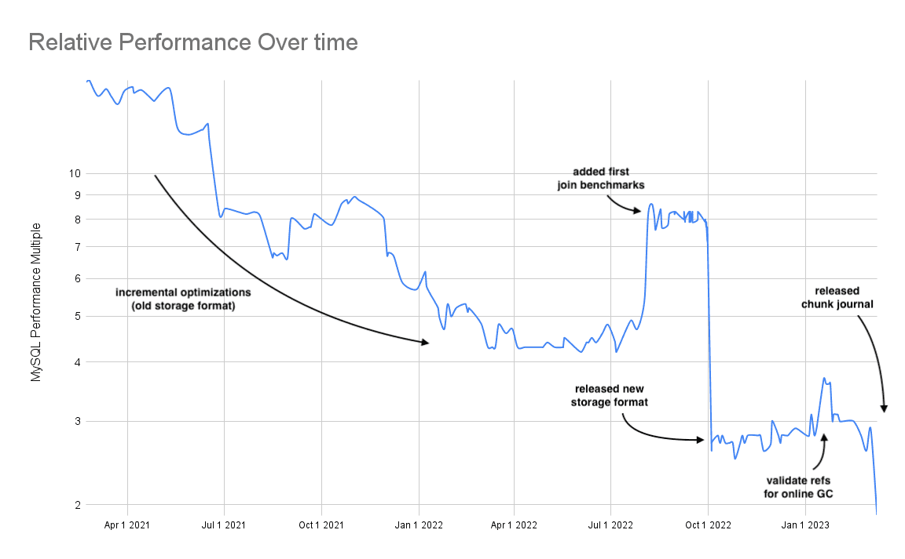

This is the weekly CEO update from [DoltHub](https://www.dolthub.com/). I'm Tim, the CEO of DoltHub. 

DoltHub is safe from the [bank troubles this week](https://techcrunch.com/2023/03/09/silicon-valley-bank-shoots-self-in-foot/). If we go out of business, we're going to do it the old fashioned way: by building an oddly-named database no one wants!

### Dolt 0.75.0

We had a big release this week! Dolt 0.75.0. This is the last major release before Dolt 1.0. Upgrade for write durability and performance improvements.

This release turns [the Dolt chunk journal](https://www.dolthub.com/blog/2023-03-08-dolt-chunk-journal/) on by default. A few people have been testing it since [it was released behind a flag at the start of the year](https://www.dolthub.com/blog/2023-01-04-acid-transactions/). The big win is write durability and write performance. Dolt is now under 2X slower than MySQL on the standard `sysbench` test suite.

### Spatial Indexes

[Spatial Indexes](https://www.dolthub.com/blog/2023-03-03-spatial-indexes/) were released behind a feature flag last week. We expect to have spatial indexes on by default in the next release. Dolt is ready for your spatial databases now. Dolt supports 90% of the spatial features in MySQL. Try it out and [let us know](https://github.com/dolthub/dolt/issues) if we're missing something you need.

### New Medical Price Bounty

Medical prices are becoming [Dolt's Linux](https://www.dolthub.com/blog/2020-07-20-search-for-dolt-linux/). We've been working with [the massive health insurance price dump](https://www.dolthub.com/blog/2022-09-02-a-trillion-prices/) for months now. We're back at it, [this time collecting a set of prices for popular codes for only hospitals](https://www.dolthub.com/repositories/dolthub/hospital-prices-allpayers). We have a medium term plan that [you can read about here](https://www.dolthub.com/blog/2023-03-6-open-source-hospital-price-transparency-2/).

Until next week. As always, just reply to this email if you want to chat.

--Tim
