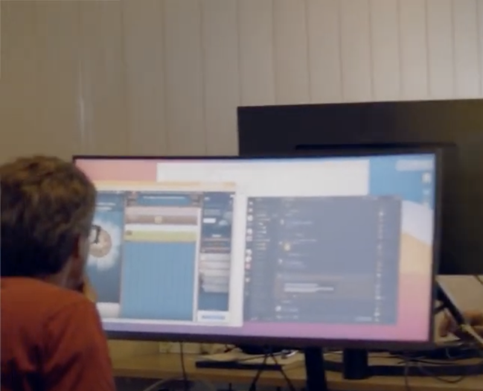
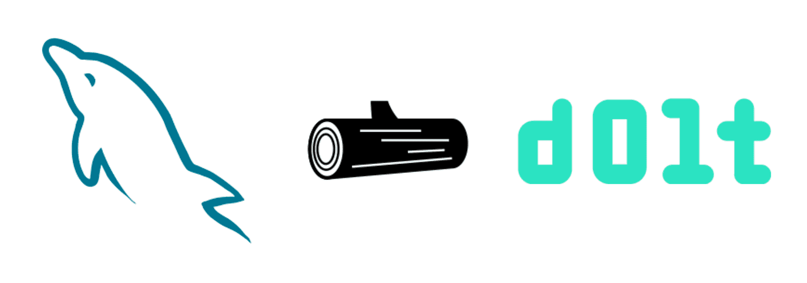

This is the weekly CEO update from [DoltHub](https://www.dolthub.com/). I'm Tim, the CEO of DoltHub. 

This week, my co-founder [Aaron](https://www.dolthub.com/team#aaron) let me in on a long standing joke. We went through a brief stint a year ago, trying to do video marketing. You can see the evidence on [our YouTube channel](https://www.youtube.com/@dolthub4295). We had a film crew come by and film some B-roll and they used some of it in the videos. When I was reviewing one of these I was confronted with this gem.

I got all mad and I was like, "You can't be playing Cookie Clicker in our videos!" He told me this week that it was staged just to mess with me. Well played, sir. Well played.

### Versioned MySQL Replica

We settled on a name for our new MySQL binlog replication mode: the Versioned MySQL Replica. This week we published [a Getting Started guide for this mode](https://www.dolthub.com/blog/2023-03-15-getting-started-versioned-mysql-replica/). In this mode, you set up Dolt as a replica of your primary MySQL database. Every write to the primary is replicated to Dolt and a new Dolt commit is created. This means you get the ability to find bad changes to your primary MySQL and create SQL patches to roll bad changes back. [The blog](https://www.dolthub.com/blog/2023-03-15-getting-started-versioned-mysql-replica/) has detailed example. You can do all this without migrating your primary off of MySQL.

### 

### Non-Dolt Content

We published a couple non-Dolt pieces of content this week. The first is [how to make Gatsby builds in GitHub Actions incremental](https://www.dolthub.com/blog/2023-03-10-caching-gatsby-builds-with-docker-in-github-actions/). The second is [Golang concurrency practical examples](https://www.dolthub.com/blog/2023-03-13-golang-concurrency-examples/). We don't need to be writing about the coolest database on earth all the time, just most of the time.

Until next week. As always, just reply to this email if you want to chat.

--Tim
