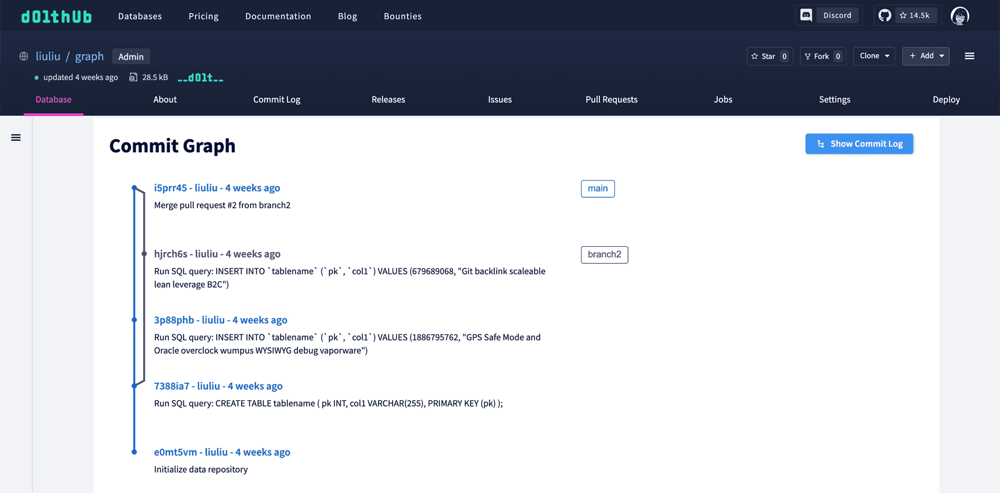

This is the weekly CEO update from [DoltHub](https://www.dolthub.com/). I'm Tim, the CEO of DoltHub. 

I know what you all are thinking, "Where was my Friday Tim email? I hope he's ok." 

Well, I was on vacation last week so you get a Monday email instead of a Friday email. I appreciate all the concern even though I did not receive a single "Are you ok?" email. 

### ChatGPT Integration

[Zach](https://www.dolthub.com/team#zach) was hard at work trying to capitalize on the ChatGPT hype on DoltHub's behalf. He wrote the `dolt assist` command that can be used as long as you have [an OpenAI API Key](https://platform.openai.com/account/api-keys). It's in the public release of Dolt after `0.75.10`. 

Here is [the announcement blog](https://www.dolthub.com/blog/2023-03-07-dolt-assistant/) where Zach explains how he did it. I liked the prompt engineering section in particular. 

Here's a simple little demo to wet your appetite. 

```
$ dolt assist
# Welcome to the Dolt Assistant, powered by ChatGPT.
# Type your question or command, or exit to quit.

# DISCLAIMER: Use of this tool may send information in your database, including 
# schema, commit history, and rows to OpenAI. If this use of your database information 
# is unacceptable to you, please do not use the tool.

Continue? (y/n) > y
# You can disable this check in the future by setting the DOLT_ASSIST_AGREE environment 
# variable.
> what tables are in this database?

Runnning query "SHOW TABLES"...
+----------------------------+
| Tables_in_clone_baby_clone |
+----------------------------+
| t                          |
+----------------------------+


> give me all the rows in table t

Runnning query "SELECT * FROM t"...
+----+
| c1 |
+----+
| 0  |
| 1  |
+----+


> what is the maximum value in c1 in table t?

Runnning query "SELECT MAX(c1) FROM t"...
+---------+
| MAX(c1) |
+---------+
| 1       |
+---------+

```

If you want to use my API key to play with it, just reply and I'll send you mine. I have a $20 monthly maximum so don't get any ideas!

### Commit Graphs on DoltHub

We launched [commit graphs on DoltHub](https://www.dolthub.com/blog/2023-04-03-introducing-the-dolthub-commit-graph/)! In this case, a picture is worth 1,000 words.

[](https://www.dolthub.com/blog/2023-04-03-introducing-the-dolthub-commit-graph/)

### Dolt and AWS

Here we go again with the [Dolt replica](https://www.dolthub.com/blog/2023-04-05-versioned-mysql-replicas-on-hosted-dolt/) theme. If you're running MySQL in AWS, [Jason](https://www.dolthub.com/team#brian) explains how easy it is to get a [Hosted Dolt](https://hosted.doltdb.com/) replica going. [You should just do this](https://www.dolthub.com/blog/2023-04-05-versioned-mysql-replicas-on-hosted-dolt/). Get your MySQL insurance now!

Continuing with the AWS theme, [Brian](https://www.dolthub.com/team#brian) wrote [a blog explaining how to get a serverless website powered by Hosted Dolt and AWS Amplify](https://www.dolthub.com/blog/2023-03-31-dolt-amplify-webapp/). This is a primer for his next blog where he'll show off some features of Dolt in this environment.

Until next week. As always, just reply to this email if you want to chat.

--Tim
