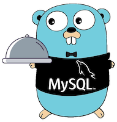
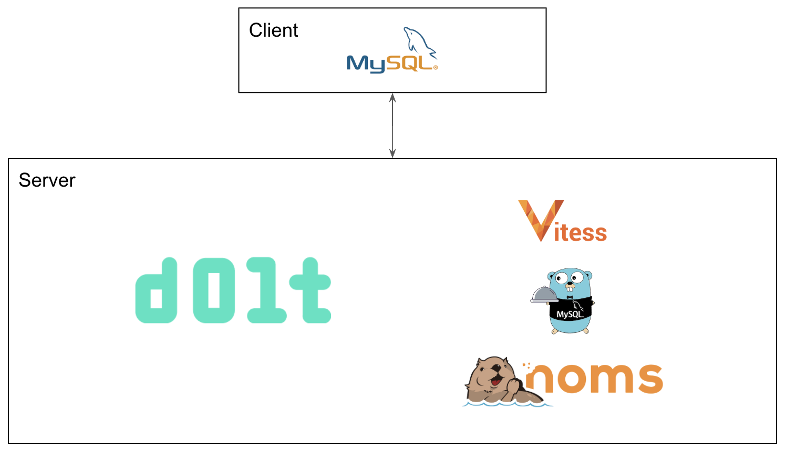

This is the weekly CEO update from [DoltHub](https://www.dolthub.com/). I'm Tim, the CEO of DoltHub. 

We made a mascot/logo for [`go-mysql-server`](https://github.com/dolthub/go-mysql-server) this week. 

We hope you like it. We had some debate about bowtie on or off. I made the case that it makes him look like he's leading a double life as [Magic `go-mysql-server`](https://www.imdb.com/title/tt1915581/). Reply to this email for more details.

### Clone a Hosted Dolt

### Dolt Architecture Primer

I've long been ashamed of our lack of a good architecture introduction in [our documentation](https://docs.dolthub.com/introduction/what-is-dolt). That is [now fixed](https://docs.dolthub.com/architecture/architecture). This [blog](https://www.dolthub.com/blog/2023-04-19-dolt-architecture-intro/) explains why we built Dolt the way we did and the building blocks we used. 

### Panic! 

[To panic](https://www.dolthub.com/blog/2023-04-14-keep-calm-and-panic/) or [not to panic](https://www.dolthub.com/blog/2020-11-16-panics-to-errors/)? That is the question. We've [published blogs](https://www.dolthub.com/blog/?q=panic) on both sides of the Golang panic debate now. People can get [really fired up](https://www.reddit.com/r/golang/comments/12pq003/panics_are_up_to_40_faster_than_returning_errors/) about this topic it seems. The answer as with all great engineering debates is "it depends".

Until next week. As always, just reply to this email if you want to chat.

--Tim
