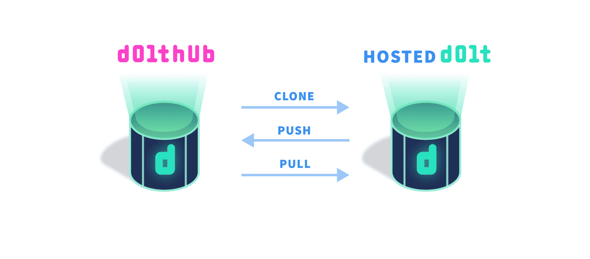

This is the weekly CEO update from [DoltHub](https://www.dolthub.com/). I'm Tim, the CEO of DoltHub. 

As part of our [Dolt 1.0](https://www.dolthub.com/blog/2023-05-05-dolt-1-dot-0/) extravaganza, we are proud to announce that [DoltHub](https://www.dolthub.com) now [runs a Dolt-powered backend](https://www.dolthub.com/blog/2023-05-12-dolthub-on-hosted-dolt/). Now you might be thinking, "Wait a second, I have Dolt databases on DoltHub. This is not news. Tim sucks at this." Well, I do suck at this but let me explain.

### DoltHub on Hosted Dolt

DoltHub always used Dolt to store and serve Dolt databases. If you have a [Dolt database on DoltHub](https://www.dolthub.com/profile/discover), first off, thank you. We store the data for your database in S3 and an API reads that data and serves it to the website. The API has a library dependency on Dolt. It does not use the SQL interface. In this way, we say DoltHub databases are "offline". Most people notice this when they [run a SQL query locally and it takes 10ms and they run it on DoltHub and it times out](https://github.com/dolthub/dolthub-issues/issues/266). This is because our API is using S3 as a disk which is way slower than an SSD. But I digress.

DoltHub also used to run a Postgres database to store metadata like users, pull requests, issues, and all the other glue data that doesn't live in your Dolt database. When we shipped DoltHub in fall 2019, Dolt was not ready to be a production database. It was a data sharing tool. Well, [Dolt 1.0](https://www.dolthub.com/blog/2023-05-05-dolt-1-dot-0/) is now a production grade OLTP database and you can feel it on DoltHub. There is no performance or reliability difference. Please click around. DoltHub is smooth.

And we get all the great version control features of Dolt. I'm no longer worried about [a bad script wiping DoltHub out for a month](https://www.dolthub.com/blog/2022-04-14-atlassian-outage-prevention/).

### Clone a DoltHub Private Database to Hosted

Hosted Dolt just keeps getting upgrades. This time, you can now [hook up a Hosted Dolt to a private DoltHub database](https://www.dolthub.com/blog/2023-05-17-dolthub-as-a-remote-for-hosted/). Previously you could clone and pull public databases from DoltHub. Now you can push public databases and clone, push, and pull private databases because Hosted Dolt can have the right credentials.

### Nautobot is on Dolt 1.0

More 1.0 news. We migrated the [latest Nautobot with the version control plug in to Dolt 1.0](https://www.dolthub.com/blog/2023-05-10-nautobot-and-dolt/) as well. [Network To Code](https://www.networktocode.com/) is an early believer in the power of a version controlled database. If you are looking for solutions in the network automation space, please talk to them and ask about Nautobot with the version control plug in.

Until next week. As always, just reply to this email if you want to chat.

--Tim
