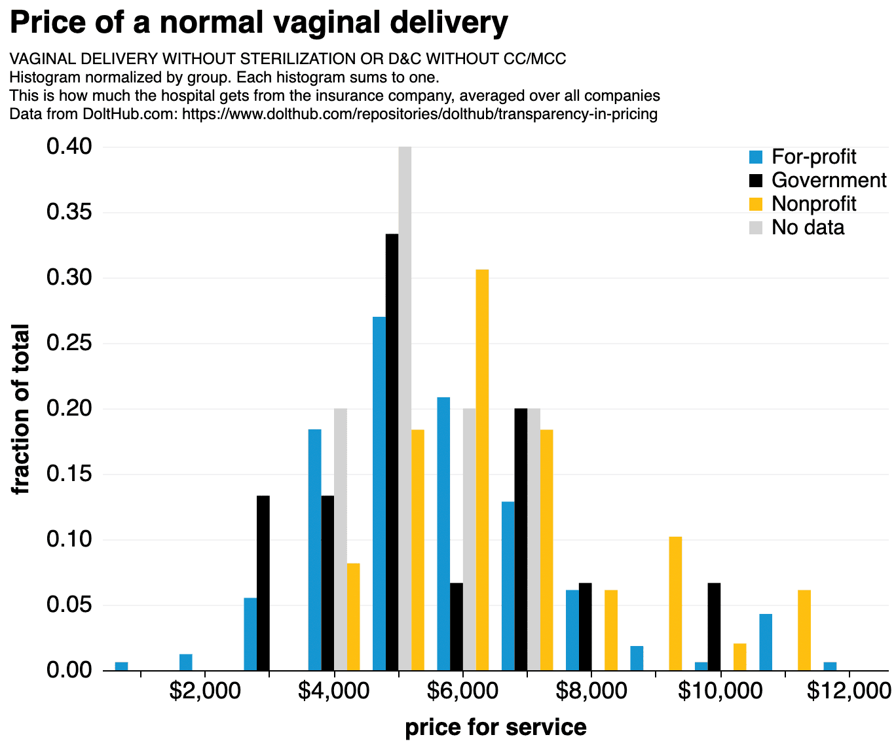

This is the weekly CEO update from [DoltHub](https://www.dolthub.com/). I'm Tim, the CEO of DoltHub. 

I got to make [a whole blog article](https://www.dolthub.com/blog/2023-05-22-just-dolt/) full of fake "Just Dolt" advertisements.  Some people think "Dolt" is "DoIt", "Do It" with the space removed. So, I riffed on "Just Do It." There is a point though. I'm trying to [explain Dolt use cases better](https://www.dolthub.com/blog/2023-05-22-just-dolt/). 

### C to WASM to Go

We started supporting [collations and character sets](https://www.dolthub.com/blog/2022-08-29-finally-adding-collations/) in Dolt last August. There was one big weakness in our support: regular expressions. `LIKE` was not collation aware.

MySQL implements regexes using [ICU](https://icu.unicode.org/design/regular-expressions/utext-for-regex) which is a C library. We faced a choice. We could try and make ICU work in Golang or we could write our own ICU regex emulator. [Daylon](https://www.dolthub.com/team#daylon) talks about [his journey](https://www.dolthub.com/blog/2022-08-29-finally-adding-collations/) figuring out a way to include ICU in Dolt while keeping Dolt a single compiled binary. 

In a shocking twist, [the answer is WASM](https://www.dolthub.com/blog/2022-08-29-finally-adding-collations/)!

### Hospital Price Bounty Update

Hospital Price Transparency is our open data mission. We're taking our fourth pass at Hospital charge masters and it's our best yet. [Spacelove](https://www.dolthub.com/team#alec) wrote about [the database and some data exploration he did](https://www.dolthub.com/blog/2023-05-24-400-hospitals/).

### How to Support Us

It's a holiday weekend here is the USA so maybe people are feeling a bit generous? Here's a list of ways to support us from cheapest on up.

1. **Free** - Use the product and tell us what you're using it for. Run a Dolt database and share it with your teammates on [DoltHub](https://www.dolthub.com) or [DoltLab](https://www.doltlab.com). Star [our Github repo](https://github.com/dolthub/dolt).
2. **Free** - Cut [GitHub Issues](https://github.com/dolthub/dolt/issues) for bugs you find or improvements you want. Come to [our Discord](https://discord.com/invite/RFwfYpu) for live support.
3. **Free** - Tell other people about us. Write a blog or make a Youtube video about Dolt.
3. **Free to start** - Sign up for DoltHub Pro. You'll pay $50/month after you have over 100MB of databases on DoltHub. Unlimited users.
4. **Any Amount** - [GitHub sponsor the DoltHub organization](https://github.com/sponsors/dolthub).
5. **$50/month and up** - Deploy a [Hosted Dolt](https://hosted.doltdb.com) Instance. Power a production workload with it.
6. **$5,000/month** - [Buy support](https://www.dolthub.com/pricing) for Dolt, DoltHub, DoltLab and all our other products. This price is negotiable depending on your support needs.

Until next week. As always, just reply to this email if you want to chat.

--Tim
