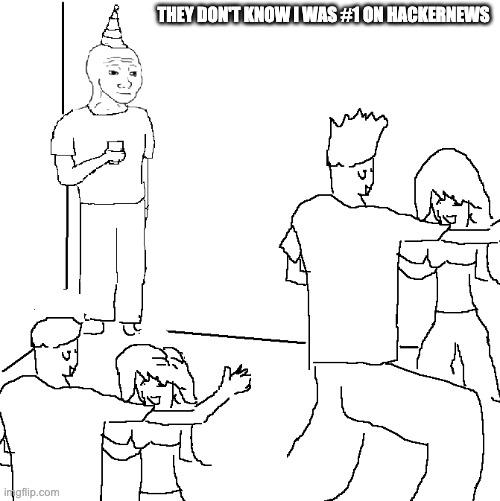

This is the weekly CEO update from [DoltHub](https://www.dolthub.com/). I'm Tim, the CEO of DoltHub. 

It's that time gain. We were number one on HackerNews for our [open source hospital price transparency work](https://www.dolthub.com/repositories/dolthub/transparency-in-pricing). This is a live look into a Manhattan nightclub.

### Dolt CLI Upgrade

Those of you that have tried Dolt know that it kind of has two modes:

1. [Version Controlled Database](https://docs.dolthub.com/introduction/getting-started/database)
2. [Git for Data](https://docs.dolthub.com/introduction/getting-started/git-for-data)

In the version controlled database mode, you start a running server and access Dolt via a MySQL compatible client. Version control functionality is accessed via SQL [procedures](https://docs.dolthub.com/sql-reference/version-control/dolt-sql-procedures), [functions](https://docs.dolthub.com/sql-reference/version-control/dolt-sql-functions), or [system tables](https://docs.dolthub.com/sql-reference/version-control/dolt-system-tables). In Git for Data mode, you open a terminal and access version control features and SQL via the [Dolt CLI](https://docs.dolthub.com/cli-reference/cli). 

These didn't really work all that well together, especially for write operations. [Neil](https://www.dolthub.com/team#neil) joined a few months ago and this bothered him. So, he [set out to fix it. Read about his progress](https://www.dolthub.com/blog/2023-06-12-cli-to-sql/). 

### Running a Database in Production

[Hosted Dolt](https://hosted.doltdb.com/) continues to improve. It's been in released for about a year and we continue to add features to it. Recently, we [released read replicas](https://www.dolthub.com/blog/2023-05-31-hosted-dolt-replication/). All the work we put into making Hosted Dolt a great product to build your version controlled application on inspired [Brian](https://www.dolthub.com/team#brian) to write about [all the things you need to built to run a database in production](https://www.dolthub.com/blog/2023-06-14-running-a-production-db/).

### MySQL Triggers

[Zach](https://www.dolthub.com/team#zach) wrote a [really great blog about triggers](https://www.dolthub.com/blog/2023-06-09-writing-mysql-triggers/). He doesn't really brag enough about Dolt's support for triggers. With Dolt, you can review trigger SQL in a Pull Request before it goes live. With Dolt, you can use triggers to manage data on branches or fire off merges. As you move more logic into your database, Dolt becomes the best option for managing all that logic because it is version controlled.

Until next week. As always, just reply to this email if you want to chat.

--Tim
