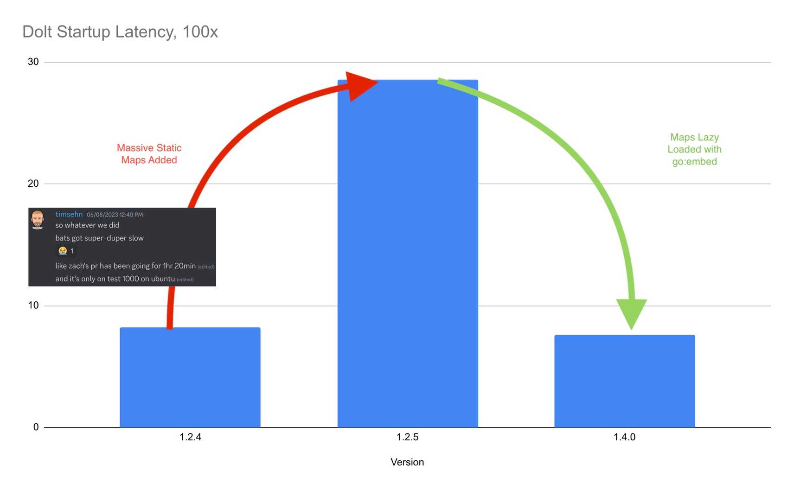

This is the weekly CEO update from [DoltHub](https://www.dolthub.com/). I'm Tim, the CEO of DoltHub. 

One of the joys of using [Discord](https://discord.gg/gqr7K4VNKe) for both our company and customer chat is seeing people's gamer tags. People show up with names like "CaptainStabs" or "Vecna". Some change it and some people roll with it. I like Discord because it's free for our customers. Come as you are!

### Slowly Changing Dimension

I wrote an opus on [Slowly Changing Dimension](https://www.dolthub.com/blog/2023-06-22-slowly-changing-dimension/). I know, I know, you love to see "21 minute read" at the top of a blog. You don't need to read it unless you're curious. Just know, if you use Dolt, you get Slowly Changing Dimension on every column in your database. Your application can't even screw it up. 

### Commit is Overloaded

In Dolt, we have two types of commits: Transaction commits and Dolt commits. In standard SQL you commit a transaction. In Git, you make a commit when you want to permanently store the state of your repository. In Dolt, we support both of these concepts, overloading the term. It can be a bit confusing. Too make it even more confusing, you can [turn on `@@dolt_tranasction_commit`](https://www.dolthub.com/blog/2023-06-21-automatic-dolt-commits/) and get Dolt commits automatically for every sql transaction commit.

We're really focused on making easy ways to get stated with Dolt. We can't expect everyone to adopt Dolt as their primary database and rewrite their application code to take advantage of version control functionality. [Jason makes a good case](https://www.dolthub.com/blog/2023-06-21-automatic-dolt-commits/) that `@@dolt_tranasction_commit` is a great way to get started with Dolt. You don't need to change any application code to see how Dolt version control could make your life way easier, especially in [an Atlassian situation](https://www.dolthub.com/blog/2022-04-14-atlassian-outage-prevention/). 

### Golang Map Initialization

Our latest [Golang blog](https://www.dolthub.com/blog/?q=golang) is a banger. [Aaron](https://www.dolthub.com/team#aaron) writes about [Golang static map initialization](https://www.dolthub.com/blog/2023-06-16-static-map-initialization-in-go/). We slowed Dolt way down when we [added a bunch of supported collations](https://docs.dolthub.com/sql-reference/sql-support/miscellaneous#collations-and-character-sets) and this technique fixed it.

Until next week. As always, just reply to this email if you want to chat.

--Tim
