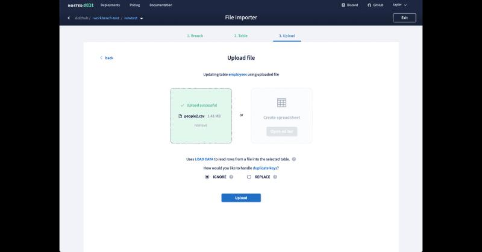

This is the weekly CEO update from [DoltHub](https://www.dolthub.com/). I'm Tim, the CEO of DoltHub. 

{Joke}

### CSV Support In Hosted Workbench

If you haven't checked out the [Hosted Dolt](https://hosted.doltdb.com/) Workbench, now is the time. It's like an online DoltHub, complete with query execution, diffs, and Pull Requests on your Hosted Instance. [Taylor](https://www.dolthub.com/team#taylor) added [CSV support](https://www.dolthub.com/blog/2023-06-30-hosted-workbench-csv-support/) recently based on a number of customer requests. 

The Hosted Dolt Workbench will continue to evolve and we hope to make it open source. It's a great example of a Dolt <> GraphQL <> React stack and we could make it work for non-Dolt databases.

### DoltLab with Hosted Dolt

As part of our [Dolt 1.0 extravaganza](https://www.dolthub.com/blog/2023-05-05-dolt-1-dot-0/), we moved [DoltLab](https://www.doltlab.com) off of Postgres and onto Dolt. That means you can now [use DoltLab with a Hosted Dolt instance](https://www.dolthub.com/blog/2023-07-05-running-doltlab-on-hosted-dolt/). If you're running DoltLab for your team and you want to get all the features of a Hosted Dolt instance, check it out. 

### Making Dolt work with...

We had a user who tried to make Dolt work as a backend for an existing tool. He ran into a couple MySQL compatibility bugs importing the schema and data. The [first](https://github.com/dolthub/dolt/issues/6290) was a parser bug with reserved word quoting and the [second](https://github.com/dolthub/dolt/issues/6291) was supporting `CONVERT USING` syntax. As you can see we're very deep in the weeds on MySQL compatibility. We fixed both in a couple hours.

The user said he had run into other issues in the past and did not want to "bother us". Please, please, please. Bother us. MySQL compatibility issues are #1 priority for us. We know there are people trying Dolt hitting these issues and moving on to something else. We tend to turn around fixes in 1-2 days. 

Until next week. As always, just reply to this email if you want to chat.

--Tim
