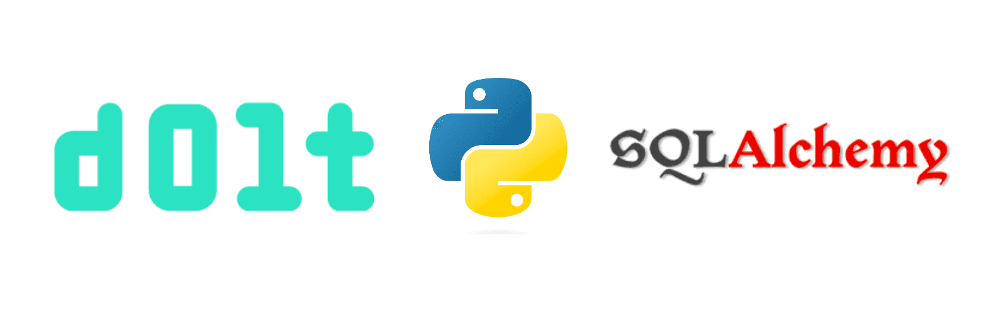

This is the weekly CEO update from [DoltHub](https://www.dolthub.com/). I'm Tim, the CEO of DoltHub. 

We had a number of new people subscribe to this list because of our [Golang articles](https://www.dolthub.com/blog/?q=golang). I apologize in advance because you're going to get a lot more database version control and open data content than Golang content. We're glad you are here but fair warning.

### Dolt and SQLAlchemy

We get a lot of people asking "How do you use Dolt with SQLAlchemy?". Well, I can now point them at a 3000 word, 23-minute read [opus on how to use Dolt with SQLAlchemy](https://www.dolthub.com/blog/2023-07-12-sql-alchemy-getting-started/) complete with [runnable sample code](https://github.com/timsehn/dolt-sqlalchemy-getting-started/). 

Of note, this is my personal best (worst?) blog read time of 23 minutes narrowly edging out my recent [slowly changing dimension post](https://www.dolthub.com/blog/2023-06-22-slowly-changing-dimension/) at 21 minutes. I'm diving deep these days.

### DoltHub in Docs

[Liu Liu](https://www.dolthub.com/team#liu) continues to make awesome improvements to our DoltHub UIs. You can thank her for [ER Diagrams](https://www.dolthub.com/blog/2022-10-05-er-diagrams-on-dolthub/) and [Commit Graphs](https://www.dolthub.com/blog/2023-04-03-introducing-the-dolthub-commit-graph/). This week, she added an embedded DoltHub UI in our documentation. You can experiment directly with Dolt system table queries [right in our docs](https://docs.dolthub.com/sql-reference/version-control/dolt-system-tables#dolt_branches).

As I [mentioned](https://twitter.com/timsehn/status/1678463411011866625), we could make this widget available for your public databases on DoltHub. Currently we whitelist our sites but with a little work we can make it an embeddable widget for all. Let me know if that is something you would like.

### Golang 1.21 Preview

We write a [Golang focused blog](https://www.dolthub.com/blog/?q=golang) every three weeks or so. The latest installment is a preview of [Golang 1.21](https://www.dolthub.com/blog/2023-07-07-golang-1.21-release/). [Jason](https://www.dolthub.com/team#jason) discusses fixing loop variable capture, the new APIs, and new standard library additions. Thanks also to [Golang Weekly](https://golangweekly.com/) who usually features these blog posts.

Until next week. As always, just reply to this email if you want to chat.

--Tim