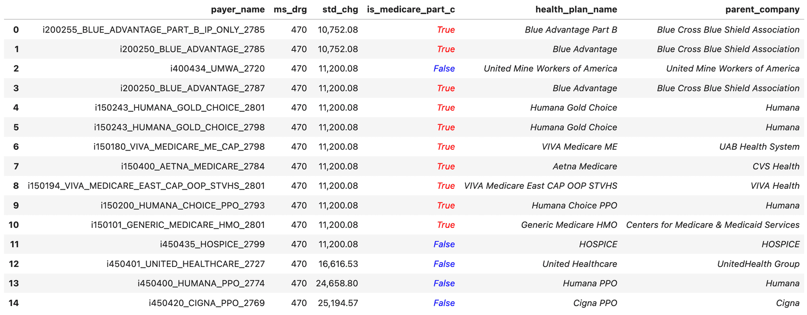

This is the weekly CEO update from [DoltHub](https://www.dolthub.com/). I'm Tim, the CEO of DoltHub. 

Just to get everyone caught up. I write all these emails myself. The structure is introduction, joke, three topics, closing. This means I have to write a joke per week. Sometimes there's a natural joke but most times it's really hard. This is one of those times. Let's recycle one! The [first joke I made](https://github.com/dolthub/weekly-updates/blob/main/emails/2022/2022-08-05.md) was "I'm Tim, the mad scientist CEO that decided MySQL and Git should have a beautiful Dolt baby." Not super proud of that one.

### Full-Text Indexes Released

A [long-standing feature request](https://github.com/dolthub/dolt/issues/2987) was [Full-Text Indexes](https://www.dolthub.com/blog/2023-07-26-announcing-fulltext-indexes/). Full-text indexes was our last major MySQL feature gap. Not any longer!

[Daylon](https://www.dolthub.com/team#daylon) has been grinding away at these for a few months and [released the first version](https://github.com/dolthub/dolt/releases/tag/v1.8.5) this week. The scope of the feature is [a bit limited](https://www.dolthub.com/blog/2023-07-26-announcing-fulltext-indexes/#whats-missing) in the initial release. Let us know if you want any additional features. 

### Using GPT Functions to Label Hospital Price Data

[Spacelove](https://www.dolthub.com/team#alec), our resident bounty administrator and medical price expert, has been busy for the better part of a year building the world's best open medical price data using [data bounties](https://www.dolthub.com/bounties). The latest one we're working on is [hospital prices](https://www.dolthub.com/repositories/dolthub/transparency-in-pricing). This is our fourth shot at it so this is [the best database we've ever built](https://www.dolthub.com/blog/2023-06-28-how-not-to-hpt/). We're [almost to 1000 hospitals](https://www.dolthub.com/repositories/dolthub/transparency-in-pricing/query/main?active=Tables&q=SELECT+count%28*%29%0AFROM+%60hospital%60%0Awhere+last_updated+is+not+null%0ALIMIT+200%3B%0A) with very clean data.

One of the challenges working with this data is adding meaning to the insurance plan strings hospitals use in their price lists. Spacelove thought of using [GPT Functions](https://www.dolthub.com/blog/2023-07-24-gpt-4-insurance-labeling/#gpt-4) to label these strings with additional metadata like whether a plan was Medicare or not. Lo and behold, it worked (mostly)! 

This was our first use as a company of GPT outside of GitHub copilot. These GPT functions are like a programmable Google search. The possibilities for data labeling are pretty compelling.

### Improved Dolt CLI

One of the problems that plagued the Dolt CLI was the presence of a running SQL server. At first, we would just happily stomp on the underlying data that was being used by the CLI and running server, with sometimes disastrous results. Stupid concurrency. So, to fix that, we added a lock file so write commands from the CLI wouldn't work when a Dolt server was running. Lock files are error prone and we still got bitten by edge cases. Plus, people were like, "I just want to run `dolt commit` what do you mean the database is locked?"

The obvious solution was to make the CLI work whether there was a server running or not. This is obvious but tricky to do. Well, [we pulled it off](https://www.dolthub.com/blog/2023-07-21-cli-to-hosted/)!. You can now use most Dolt CLI commands with a running server. This has the added benefit of making the CLI work with a server running somewhere else, like a [Hosted Dolt](https://hosted.doltdb.com/) server. Let us know if you have a CLI command that doesn't work yet fixed.

Until next week. As always, just reply to this email if you want to chat.

--Tim
