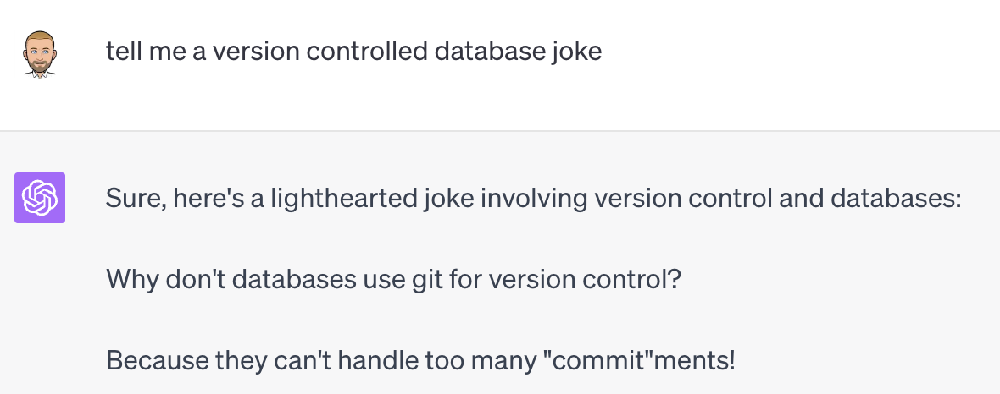
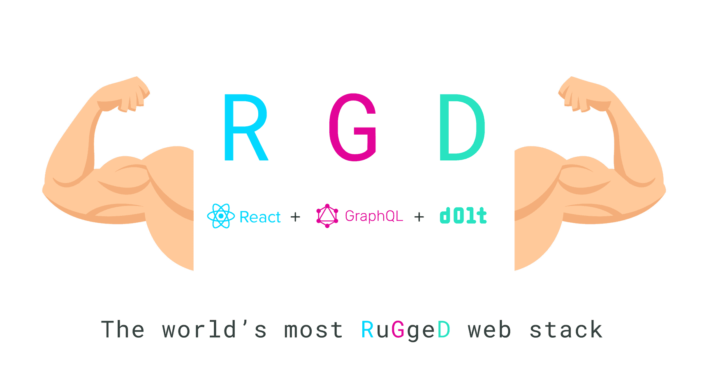

This is the weekly CEO update from [DoltHub](https://www.dolthub.com/). I'm Tim, the CEO of DoltHub. 

Many people responded to my complaints about joke writing with the suggestion to use GPT to write my jokes. This is a bad idea. Jokes are funny. Jokes are important. Jokes are dangerous. Jokes are art. I refuse to cede this responsibility to the machines. GPT jokes are terrible.

### RugGeD Stack

We are out to prove to the world that Dolt "just works" with your favorite tools. In service of this mission, [Taylor](https://www.dolthub.com/team#taylor) coined the RGD stack, pronounced rugged, in her [latest blog](https://www.dolthub.com/blog/2023-08-02-workbench-architecture-and-rgd-stack/). RGB stands for React GraphQL Dolt. Dolt just works with your favorite web front end tools. 

If your more of a sample code kind of developer, [this repository](https://github.com/dolthub/react-graphql-dolt-sample-app) goes even deeper than the blog could. Add Git-style features to your web applications using Dolt following this framework.

### Dolt Analyzer Performance

A database can be broken up into three pieces: storage engine, analyzer, and parser. We're at the stage of database development where we're starting to tackle analyzer correctness and performance. The database analyzer is responsible for turning queries into execution plans. [Nick](https://www.dolthub.com/team#nick) writes about [his journey diagnosing what was wring with and fixing a slow SQL query](https://www.dolthub.com/blog/2023-07-31-solving-performance-mysteries/). He does this while weaving in a cheesy detective story. I was skeptical of this approach at first but I think it kind of worked.

### Golang Yacc Tips and Tricks

Or latest [Golang blog](https://www.dolthub.com/blog/?q=golang) covers [yacc grammar and parser generation tips and tricks](https://www.dolthub.com/blog/2023-07-28-goyacc-parser-tips-tricks/). We use the Golang yacc grammar extensively to parse SQL. [This blog](https://www.dolthub.com/blog/2023-07-28-goyacc-parser-tips-tricks/) outlines some of the things we learned from our experience.

Until next week. As always, just reply to this email if you want to chat.

--Tim