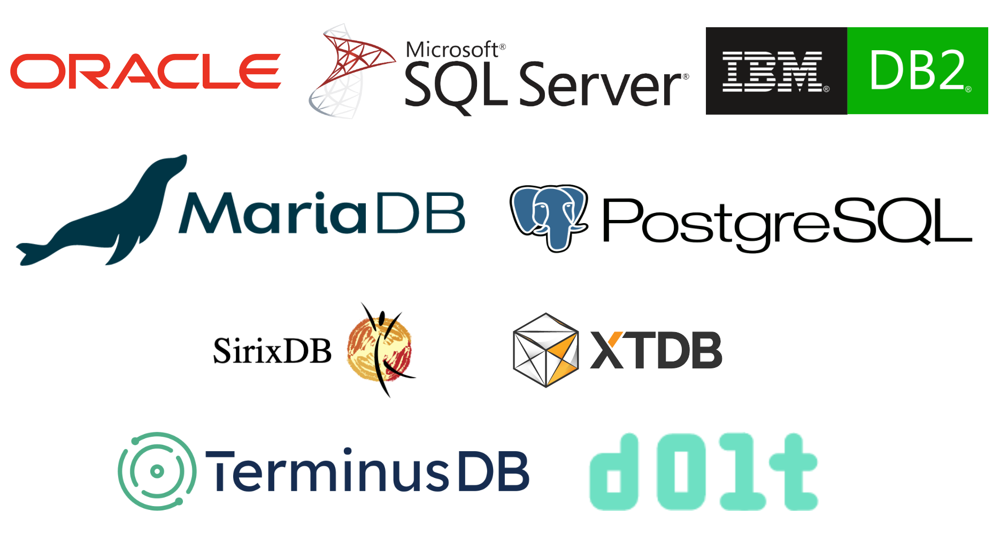

This is the weekly CEO update from [DoltHub](https://www.dolthub.com/). I'm Tim, the CEO of DoltHub. 

{Joke}

### Wordpress Works on Dolt

We are out to prove to the world that Dolt "just works" with your favorite tools. In service of this mission, [Neil](https://www.dolthub.com/team#neil) published a blog on how the world's most popular website builder, [Wordpress, works with Dolt](https://www.dolthub.com/blog/2023-08-04-wordpress-on-dolt/). Neil also shows off a clever use of Dolt tags to debug what Wordpress is actually doing when he navigates the website.

### Temporal Databases

I'm back at it again with another search focused [blog on Temporal Databases](https://www.dolthub.com/blog/2023-08-07-temporal-database/). This article explains SQL:2011 and provides a survey of some of the SQL database that implement it. It also covers some NoSQL options.

This article was fun to write because I had heard of temporal tables before but not temporal databases. I had to research a whole new space to write it. Hopefully you learn something from it too.

### Designing Dolt

[Zach](https://www.dolthub.com/team#zacvh) dives deep into [how we think about Dolt design](https://www.dolthub.com/blog/2023-08-09-coherent-design/) using Dolt session management and database branches as examples. Zach argues that designing products comes down to the "principle of least surprise". This is a good capstone on a number of projects Zach executed in the grey space between Git and MySQL where we have to invent new interfaces.

Until next week. As always, just reply to this email if you want to chat.

--Tim
