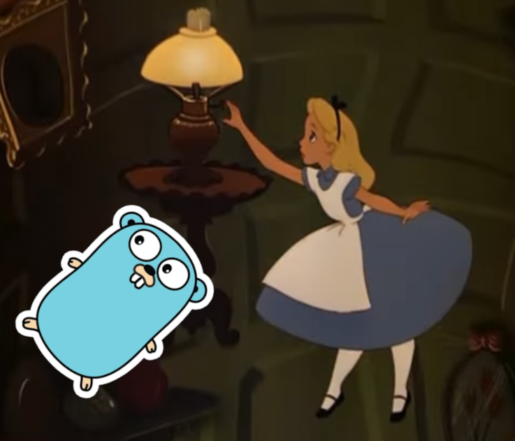

This is the weekly CEO update from [DoltHub](https://www.dolthub.com/). I'm Tim, the CEO of DoltHub. 

For [Nick](https://www.dolthub.com/team#nick)'s blog, [Avoiding Pitfalls in Go](https://www.dolthub.com/blog/2023-08-16-go-pitfalls/), he went with a Alice in Wonderland themed featured image (seen below). I suggested he have the Go Gopher drive this robotaxi instead, but my idea was rejected.

### Implementing Full-text Indexes

[Daylon](https://www.dolthub.com/team#daylon) launched full-text indexes [a month or so ago](https://www.dolthub.com/blog/2023-07-26-announcing-fulltext-indexes/). In his mad dash to get the feature launched he did not have time to do a full deep dive blog on how he implemented it. This week, he published [that deep dive](https://www.dolthub.com/blog/2023-07-26-announcing-fulltext-indexes/). This article is a good review of how indexes work in general in Dolt as well as an overview of all the extra support we built to support full text indexes.

### Better DoltHub/DoltLab API

By popular demand, we [improved the DoltHub/DoltLab API](https://www.dolthub.com/blog/2023-08-11-fine-grained-permissions-and-enhanced-dolthub-api/). You can now issue fine-grained API permissions. You can give a user access to a single API endpoint. We also added support for a number of new API calls. Automate your pull request workflows! 

DoltHub and DoltLab share the same code so any improvements we make to DoltHub go out in the next DoltLab release. This includes API code. [DoltLab 1.0.4](https://github.com/dolthub/doltlab-issues/releases/tag/v1.0.4) contains these improvements.

### Avoiding Pitfalls in Go

The latest in our [Golang blog series](https://www.dolthub.com/blog/?q=golang) is out, [Avoiding Pitfalls in Go](https://www.dolthub.com/blog/2023-08-16-go-pitfalls/). This blog covers five interesting cases, complete with code samples, that can trip up Go newcomers from other languages. Aforementioned featured image below.

Until next week. As always, just reply to this email if you want to chat.

--Tim
