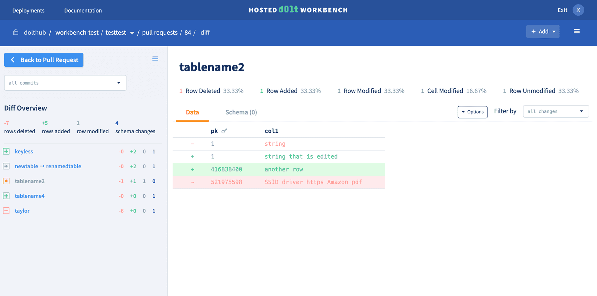

This is the weekly CEO update from [DoltHub](https://www.dolthub.com/). I'm Tim, the CEO of DoltHub. 

{Joke}

### Pull Requests in Your App

The core Dolt early adopter use cases are starting to form. People tend to use Dolt for one of three things:

1. Dolt as a feature store for an ML pipeline.
2. Dolt as the database for an app that needs pull requests.
3. Dolt and DoltHub as a replacement for a heavily edited spreadsheet.

In service of (2), [Taylor](https://www.dolthub.com/team#taylor) published [a blog on making a pull request workflow using React](https://www.dolthub.com/blog/2023-08-18-design-pull-request-workflow/), complete with [sample code](https://github.com/dolthub/react-graphql-dolt-sample-app). Taylor has built full stack pull request implementations for both DoltHub and the Hosted Dolt workbench. She's the expert here. Use her example to add pull requests to your application.

### Works with Dolt: XCA

We are out to prove to the world that Dolt "just works" with your favorite tools. In service of this mission, [Jason](https://www.dolthub.com/team#jason) published [a blog on how XCA, a popular key and certificate management tool, works with Dolt](https://www.dolthub.com/blog/2023-08-21-xca-on-dolt/). Jason even shows how you can find and rollback a bad delete using Dolt if it powers your XCA.

To get this one to work we needed to [add support for ANSI quote mode to Dolt](https://github.com/dolthub/go-mysql-server/pull/1915). This gives you an idea of where Dolt is as far as MySQL compatibility goes. We're [99.9%](https://docs.dolthub.com/sql-reference/benchmarks/correctness) there!

### Dolt for Better Database Testing

Until next week. As always, just reply to this email if you want to chat.

--Tim
