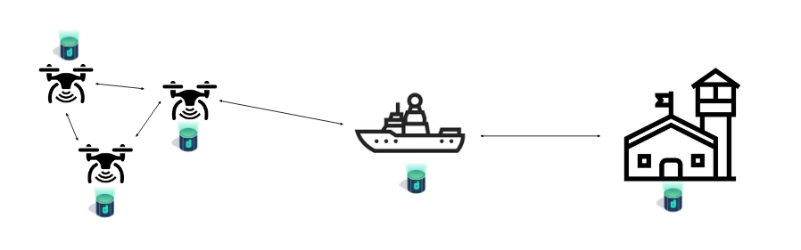

This is the weekly CEO update from [DoltHub](https://www.dolthub.com/). I'm Tim, the CEO of DoltHub. 

In the US and Canada, this weekend is [Labor Day](https://en.wikipedia.org/wiki/Labour_Day). As the part owner of a business, I refuse to observe this holiday until there is a Capital Day. [Zach](https://www.dolthub.com/team#zach) is quick to remind me that every other day is Capital Day, difficult to refute.

### Dolt for Drone Surveillance

Over the past couple months, we have been exploring an [offline first](https://docs.dolthub.com/introduction/use-cases/offline-first) Dolt use case: [Dolt for Drone Surveillance](https://www.dolthub.com/blog/2023-08-28-dolt-for-drones/). Our current customers have reliable internet connectivity and use Dolt for the version control features. In the offline first use case, the version control features power fast, resilient sync. We are excited for someone to use Dolt in this way.

### We have an On Call!

To be fair, we've had an on call since [Hosted Dolt](https://hosted.doltdb.com) launched. We now have an on call rotation. Curious about the tools and processes we used to set up our on call rotation? [Dustin](https://www.dolthub.com/team#dustin) wrote about [how we set up our on call](https://www.dolthub.com/blog/2023-08-30-how-to-create-automated-paging-on-call-at-your-startup/) here at DoltHub.

### Dolt Replication Options

Replication is a core feature of Relational Database Management Systems (RDBMS). Dolt has three replication options all with different pros and cons. [This blog](https://www.dolthub.com/blog/2023-08-25-dolt-replication-options/) walks you through your options. We could also build a "replicate Dolt to MySQL" option if there is enough interest. This would give you MySQL read performance on a branch via a MySQL replica of that Dolt branch. Reply to this email if you're interested in that.

Until next week. As always, just reply to this email if you want to chat.

--Tim
