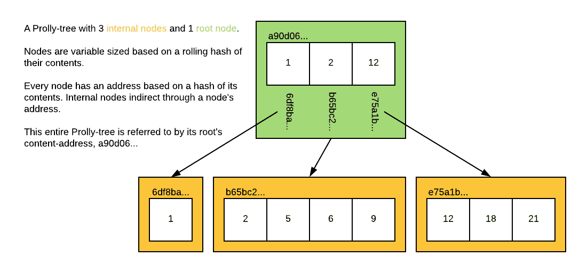

This is the weekly CEO update from [DoltHub](https://www.dolthub.com/). I'm Tim, the CEO of DoltHub. 

I've been out most of the week visiting my hometown of Sarnia, Ontario, Canada. The town is famous for [bridge fries](https://www.whattravelwriterssay.com/brennansarniaontario1.html), served from food trucks parked under the Blue Water bridge. This fry-powered CEO is ready to crank out this weekly email.

### Dolt is 99.9% Correct

We use a [suite of SQL tests](https://docs.dolthub.com/sql-reference/benchmarks/correctness) to measure Dolt's correctness against MySQL. When we started measuring Dolt correctness in 2019, [we were 90% correct](https://www.dolthub.com/blog/2019-12-17-one-nine-of-sql-correctness/). In 2021, we [crossed 99% correct](https://www.dolthub.com/blog/2021-06-28-sql-correctness-99/). After a long, hard slog by [Max](https://www'dolthub.com/team#max) rewriting the way Dolt handles aliases, we [crossed 99.9% correct](https://www.dolthub.com/blog/2023-09-06-three-9s-correctness/).

Of note, we found [a bug in our handling of `SECONDARY_ENGINE`](https://github.com/dolthub/dolt/issues/6632) that will fix 1073 of the remaining 4859 failing tests. After that, we're really in the long tail of correctness bugs. Dolt is ready for you to use as a drop in replacement for MySQL.

### Dolt Profiles

We have been doing a lot of work making [the Dolt CLI work with a running server](https://www.dolthub.com/blog/2023-07-21-cli-to-hosted/). This is especially useful in the case of [Hosted Dolt](https://hosted.doldb.com). But what if you have a bunch of Dolt's running around and you're struggling to remember all the connection details? [Dolt Profiles](https://www.dolthub.com/blog/2023-09-01-dolt-profile/) are here to save the day. Have a profile for your local Dolt instance and your production hosted instance.

### Dolt Architecture

If you are ever curious how Dolt works under the hood, [Aaron's series of how Dolt works](https://docs.dolthub.com/architecture/storage-engine#how-dolt-works-blog-series) is the best resource out there. Once you see the care and thought we put into building the world's first and only version controlled SQL database, you'll get the confidence to try Dolt for your applications.

Until next week. As always, just reply to this email if you want to chat.

--Tim
