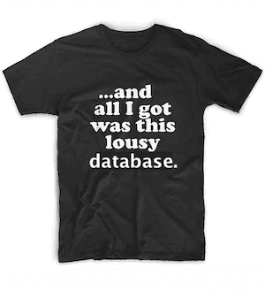

This is the weekly CEO update from [DoltHub](https://www.dolthub.com/). I'm Tim, the CEO of DoltHub. 

Below you'll see we [ended data bounties](https://www.dolthub.com/blog/2023-09-18-bye-bye-bounties/). This sadly means an end to one of my favorite jokes. One last time, this photo was captured at a Manhattan night club this past week.

[Hackernews](../images/hackernews-meme.jpeg)

### Tentacle + Dolt

The kind folks at Tentacle [featured Dolt in their Blog](https://tentaclecmi.com/case-studies/how-we-use-open-datasets-bigquery-dolthub-hugging-face-and-kaggle). Tentacle is in the data collection and forecasting business. For Tentacle, Dolt is "an absolute dream!" because of its incremental sync capabilities. 

We always love when Dolt is featured on other people's blogs. If you write a blog about Dolt, please let us know and we'll tell our audience about it. 

### Query Diff is Back

Dolt is built from the ground up to provide [fast diff](https://www.dolthub.com/blog/2022-09-09-data-diff/). What about diffing the results of arbitrary queries? We used to do that. We stopped doing it. Now, [we do it again!](https://www.dolthub.com/blog/2023-09-20-query-diff/). `dolt query-diff` is back in command line and SQL form.

The problem is that this feature does not take advantage of content-addressing to perform fast diff in the way normal `dolt diff` and the `dolt_diff` system tables do. `dolt query-diff` uses a naive, compute intensive approach to produce diffs. We can make it better. Try it out and send us your use cases so we have a better idea of how to optimize it.

### No More Data Bounties

After almost three years, we're [saying goodbye to Data Bounties](https://www.dolthub.com/blog/2023-09-18-bye-bye-bounties/). Data Bounties were cool and innovative but also expensive. We're sad to stop them and we may bring thme back in some form in  the future. Thank you to all who have contributed over the years especially `@spacelove`.

Until next week. As always, just reply to this email if you want to chat.

--Tim
