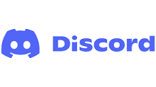
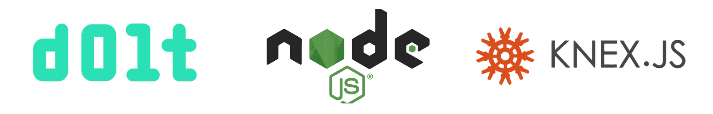

This is the weekly CEO update from [DoltHub](https://www.dolthub.com/). I'm Tim, the CEO of DoltHub. 

{Joke}

### We love Discord

Here at DoltHub, we've been on Discord for internal and external chat [for a long time](https://www.dolthub.com/blog/2020-08-26-discord/). We love it. We ened every blog with a call to action to [talk to us on Discord](https://discord.gg/gqr7K4VNKe).

This week, [Zach](https://www.dolthub.com/team#zach) wrote about [his experience administering our Discord](https://www.dolthub.com/blog/2023-09-22-running-open-source-discord/). We highly recommend moving your internal chat to Discord and the encouraging your users to come hang out with you there. The interaction with users is inspiring. 

### Dolt works with Knex

We're on a mission to show that Dolt just works with all your favorite tools in all your favorite languages. This week, the spotlight is on Javascript and the [Knex](https://knexjs.org/) framework. [Taylor](https://www.dolthub.com/team#taylor) wrote a [Getting Started blog](https://www.dolthub.com/blog/2023-09-27-dolt-and-knexjs/) complete with sample code to get you Javascript users going quickly with Dolt. We have a number of customers using Knex to connect to Dolt and power their front end applications. 

### Strange Python `autocommit` Behavior

Until next week. As always, just reply to this email if you want to chat.

--Tim
