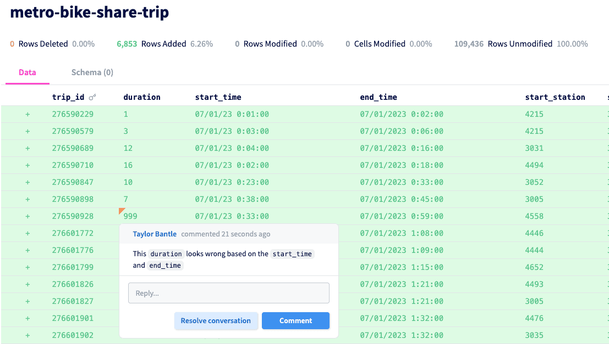

This is the weekly CEO update from [DoltHub](https://www.dolthub.com/). I'm Tim, the CEO of DoltHub. 

For those of you that are new, the format of this email is a joke followed by (usually) three topics. The running joke is I hate writing the joke. This is one of those weeks where nothing is funny. Enjoy the update. 

### Undrop

Ever since Dolt supported `DROP DATABASE`, it bothered me that it was the only SQL query that was destructive by default in Dolt. One errant `DROP DATABASE` and you lose all your data and all of its history. This made no sense. By contrast, a `DROP TABLE` could be undone with a simple `CALL DOLT_RESET()`.

Well, we fixed it. You can now [undrop Dolt databases](https://www.dolthub.com/blog/2023-10-18-undrop/) using `CALL DOLT_UNDROP()`. To free storage and drop the database permanently, you must call an additional procedure. This goes a long way to extending Dolt's lead as the most operator friendly SQL database on the market. Dolt protects you from silly mistakes you can make as a database operator.

Next up: [`reflog`](https://git-scm.com/docs/git-reflog) to help recover from bad branch deletions.

### Diff Comments

The DoltHub user interface continues to get better, merging what you love about GitHub and database workbenches. We are excited to [announce Diff comments](https://www.dolthub.com/blog/2023-10-16-pull-request-diff-comments/) on Pull Requests, a heavily requested feature. You can now comment on specific cells in the diff much like commenting on specific rows in a GitHub diff or cells in a Google Sheet/Excel Spreadsheet. 

### Bug or Intended Behavior?

As frequent readers of this email know, Dolt is a drop in replacement for MySQL. We take this promise very seriously. In [Zach's](https://www.dolthub.com/team#zach) latest [blog article](https://www.dolthub.com/blog/2023-10-13-fixing-mysql-bugs-in-dolt/), he discusses all the strange MySQL behavior we matched. He also dives into some esoteric behavior with column defaults that we think is a bug and MySQL/MariaDB does not. What should we do?

Until next week. As always, just reply to this email if you want to chat.

--Tim