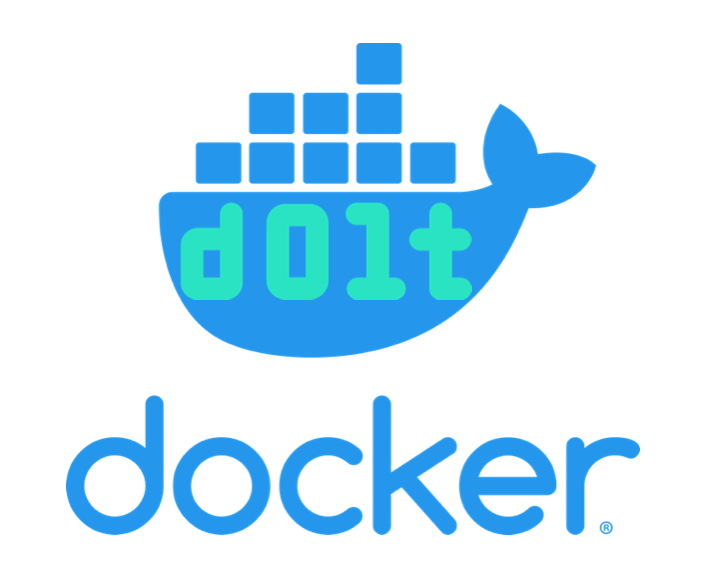

This is the weekly CEO update from [DoltHub](https://www.dolthub.com/). I'm Tim, the CEO of DoltHub. 

It's spooky season here in the US. My neighborhood goes especially over-the-top for Halloween. Last year, I got ~2,000 trick-or-treaters at my door. It's a constant stream of kids and teenagers. I just sit there and make sure no one dumps the bowl into their bag. Happy Halloween!

### Dolt in Docker

For a long time I resisted learning Docker. 

*"Dolt is a single executable", I said.*   
*"A container is overkill", I said.*   
*"For Dolt, Docker seems to cause more problems than it solves", I said.*  

But people just kept coming to [our Discord](https://discord.gg/gqr7K4VNKe) and asking for Docker. Finally, I broke and [Jennifer published a couple Dolt images on DockerHub](https://www.dolthub.com/blog/2022-10-26-publish-releases-on-dockerhub/). 

But people still showed up with more Docker questions. So recently, I set out to learn how to use Docker with Dolt and published a [Getting Started Guide to using Dolt with Docker](https://www.dolthub.com/blog/2023-10-25-dolt-docker/). It answers a bunch of common questions we get about Dolt in Docker. How do I connect from my local machine? How do I preserve data outside of the container? How do I push to DoltHub? It's all there for the Docker fans.  

### Dolt Transactions Deep Dive

We've been publishing a "works with Dolt" series on common tools that just work with Dolt. [Neil](https://www.dolthub.com/team#neil) was supposed to write about how Dolt just works with [FusionAuth](https://fusionauth.io/) but thought that was a bit too boring so he wrote about how [Dolt transactions differ from MySQL transactions instead](https://www.dolthub.com/blog/2023-10-23-hold-my-beer/). The article has some really great animated diagrams. If you really want to understand what Dolt is doing transactional-ly under the covers, [this blog](https://www.dolthub.com/blog/2023-10-23-hold-my-beer/) is for you.

### Golang Slices

[Nick](https://www.dolthub.com/team#nick) is back with the latest in [our Golang blog series](https://www.dolthub.com/blog/?q=golang). This time he talks about [the sharp edges in slices](https://www.dolthub.com/blog/2023-10-20-golang-pitfalls-3/). He's a bit more critical of Golang in this one than usual which r/golang didn't enjoy. That's the internet for you.

Until next week. As always, just reply to this email if you want to chat.

--Tim
