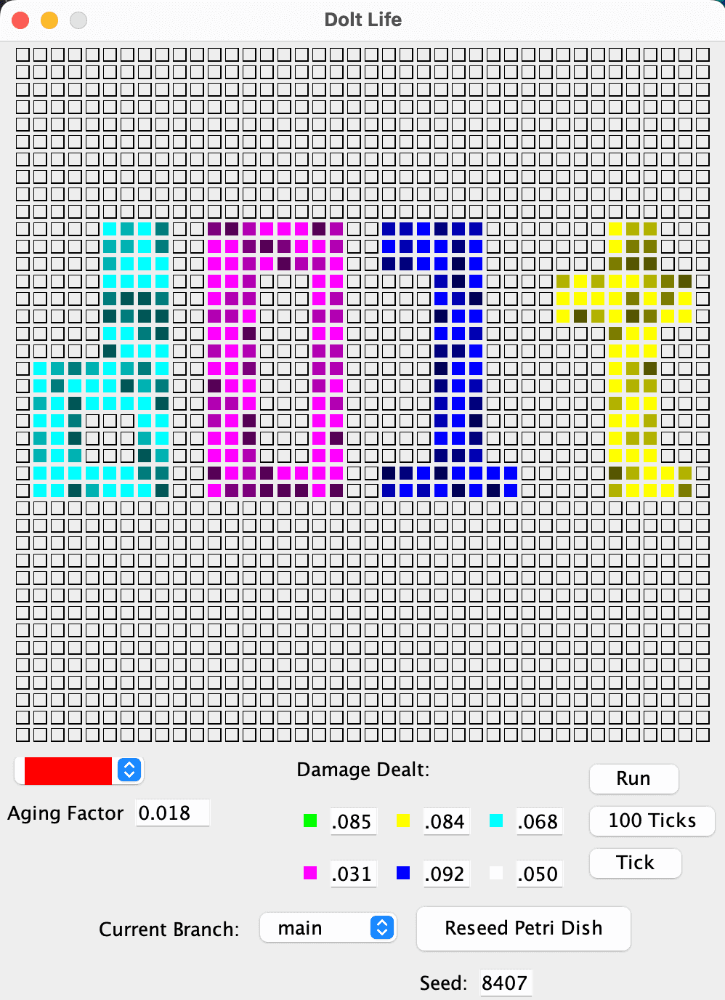

This is the weekly CEO update from [DoltHub](https://www.dolthub.com/). I'm Tim, the CEO of DoltHub. 

Thanks to everyone who starred [Doltgres](https://github.com/dolthub/doltgresql)! There's enough interest for us to dedicate two people to the project moving forward. Expect fast progress there. Star the repo if you want more resources assigned. Or just reply to this email letting me know you'd use Dolt if it were Postgres flavored. That's no joke.

### Analyzer Stats

Before this week's [release of analyzer statistics](https://www.dolthub.com/blog/2023-11-15-index-statistics/), Dolt sometimes didn't know which order to join tables. This resulted in a whole class of slow joins. "I ran this join on MySQL and it took 20ms. In Dolt, it took 8s. What's Up?" This was because Dolt only considered the size of the tables, not the size of the tables post filter. A customer could work around this with a [join hint](https://docs.dolthub.com/sql-reference/sql-support/miscellaneous#join-hints) but other databases like Postgres and MySQL are fast without hints.

Well, now Dolt can be fast without a hint as long as you run `ANALYZE TABLE` before you run the join query. This query creates histograms of the shape of the indexed data in the table called analyzer statistics. [Max's](https://www.dolthub.com/team#max) blog article, [goes into great detail on how this works with examples](https://www.dolthub.com/blog/2023-11-15-index-statistics/). Next step is to run `ANALYZE TABLE` automatically in the background so you don't have to. Stay tuned. Pun intended.

### Hibernate Works with Dolt

We're on a mission to show that Dolt just works with all your favorite tools in all your favorite languages. This week, the spotlight is on Java and the [Hibernate](https://hibernate.org/orm/) ORM. [Neil](https://www.dolthub.com/team#neil) wrote a [Conway's Game of Life Sample App](https://github.com/dolthub/hibernate-sample) and [corresponding blog](https://www.dolthub.com/blog/2023-11-13-dolt-on-hibernate/) to show off how well Dolt works with Java.

### Golang Stack Traces

[Zach](https://www.dolthub.com/team#zach) is back with the latest in [our Golang blog series](https://www.dolthub.com/blog/?q=golang). This time he talks about [stack traces in Golang](https://www.dolthub.com/blog/2023-11-10-stack-traces-in-go/). There's a bunch of ways to get Golang to produce stack traces and we use many of them in Dolt.

Until next week. As always, just reply to this email if you want to chat.

--Tim