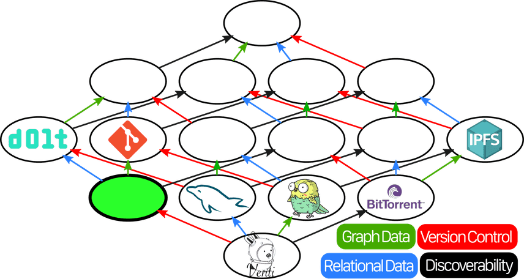

This is the weekly CEO update from [DoltHub](https://www.dolthub.com/). I'm Tim, the CEO of DoltHub. 

This week is Thanksgiving week in the US. A holiday is not going to stop me from sending my weekly email. But I'm giving thanks for not having to come up with a joke this week. 

### Dolt Reflog

Dolt's SQL engine is finally [correct enough](https://docs.dolthub.com/sql-reference/benchmarks/correctness) and [fast enough](https://docs.dolthub.com/sql-reference/benchmarks/latency) that we have time to implement more version control features. Dolt supports all the common Git operations but we're [missing a few advanced ones](https://docs.dolthub.com/cli-reference/git-comparison).

We closed the gap this week with the [release of `reflog`](https://www.dolthub.com/blog/2023-11-17-dolt-reflog/). The `reflog`, short for Reference Log, allows you to recover from operations like erroneous branch deletes by exposing a log of all the references still available in Dolt. [Jason](https://www.dolthub.com/team#jason)'s article goes into [some very helpful examples](https://www.dolthub.com/blog/2023-11-17-dolt-reflog/#dolts-reflog-in-action-%EF%B8%8F) on how to use the `reflog`.

Dolt keeps getting more safe for operators. Dolt is a database where almost all operations are recoverable. Never lose data again.

### Performance Deep Dive

We had some weird [latency benchmarking results](https://docs.dolthub.com/sql-reference/benchmarks/latency) show up on Halloween. Both MySQL and Dolt's write latency increased but MySQL's increased more making Dolt look better in comparison to MySQL. 

[Dustin](https://www.dolthub.com/team#dustin) did [an investigation](https://www.dolthub.com/blog/2023-11-22-spooky-performance-regression-aws-ebs/) and came to the conclusion that something changed with AWS EBS latencies. Spooky stuff. This [whole episode](https://www.dolthub.com/blog/2023-11-22-spooky-performance-regression-aws-ebs/) shows the difficulties of comparing database performance. Dolt is about 2X slower than MySQL but it depends on a lot of factors. Your results may vary. 

### Decentralized Databases

In May 2022 when crypto was still cool, I wrote an opus on [Decentralized Databases](https://www.dolthub.com/blog/2022-05-27-decentralized-database/) to position Dolt in that landscape. Well, decentralized databases still exist and we still think they're cool even though we're all [having fun staying poor](https://www.urbandictionary.com/define.php?term=Have%20Fun%20Staying%20Poor). [Nick](https://www.dolthub.com/team#nick) wrote another [opus on Decentralized databases](https://www.dolthub.com/blog/2023-11-20-smashing-decentralized-databases-together-for-fun-and-science/) complete with taxonomies, graphs, and all manner of pictures. It's a fun read and I promise you'll learn something.

Until next week. As always, just reply to this email if you want to chat.

--Tim