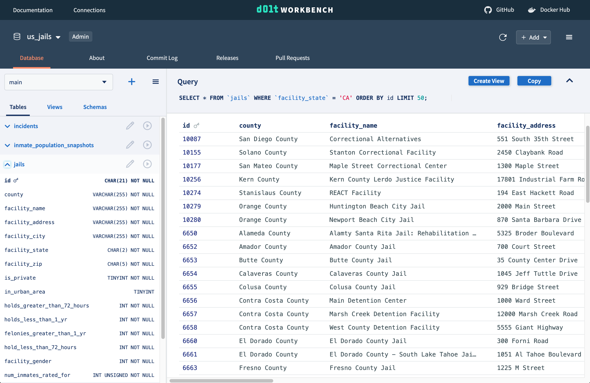

This is the weekly CEO update from [DoltHub](https://www.dolthub.com/). I'm Tim, the CEO of DoltHub. 

Fun fact about me. I have never driven my car to work in my career. I've always walked. If you can, I highly encourage it. It's like combo exercise and commute. In Los Angeles, it really freaks out my neighbors. "I always see you walking. Why? What happened to your car?" 

### Dolt Workbench Launch

It's launch week for us! We [released the Dolt Workbench](https://www.dolthub.com/blog/2023-11-29-dolt-workbench/). 

[Taylor](https://www.doilthub.com/team#taylor) has worked for years on making the SQL web workbench for [DoltHub](https://www.dolthub.com) and [Hosted Dolt](https://hosted.doltdb.com) the best out there. After seeing the Hosted workbench in action, [Brian](https://www.doilthub.com/team#brian) insisted we [open source it](https://github.com/dolthub/dolt-workbench). 

You install the Dolt Workbench using Docker, hit it with your browser, and then connect to any MySQL-compatible database including Dolt. Unlike other workbenches that have Windows 95 era user interfaces, the Dolt Workbench greets you with a modern, interactive web interface you are accustomed to. We think it's the best open source workbench out there already.

Throw the [Dolt Workbench a star on GitHub](https://github.com/dolthub/dolt-workbench) if you get a chance. Next up we'll be adding Postgres and [Doltgres](https://www.doltgresql.com) support.

### Doltgres Correctness

[Doltgres is one 7 correct!](https://www.dolthub.com/blog/2023-11-27-doltgres-sqllogic-test/) Wait. You're not impressed? OK. OK. Understandable. But you have to start somewhere. 

Dolt itself recently achieved [99.993% correctness](https://docs.dolthub.com/sql-reference/benchmarks/correctness). Doltgres has a long way to go. [Daylon](https://www.doilthub.com/team#daylon) and [Zach](https://www.doilthub.com/team#zach) are dedicated to Doltgres full time. One 9 of correctness should be achievable by year end which is where [Dolt was in late 2019](https://www.dolthub.com/blog/2019-12-17-one-nine-of-sql-correctness/). We think we can get to four 9s correctness in Doltgres by the end of 2024.

### Dolt + Excel

Last week I had the pleasure of working from home on my beefy Windows machine making [Dolt work with Excel](https://www.dolthub.com/blog/2023-11-24-dolt-excel/). Dolt is often used to replace a complicated, spreadsheet driven process. If you have a painful to maintain Excel workbook, consider Dolt for [spreadsheet version control](https://www.dolthub.com/blog/2022-07-15-so-you-want-spreadsheet-version-control/).

Until next week. As always, just reply to this email if you want to chat.

--Tim