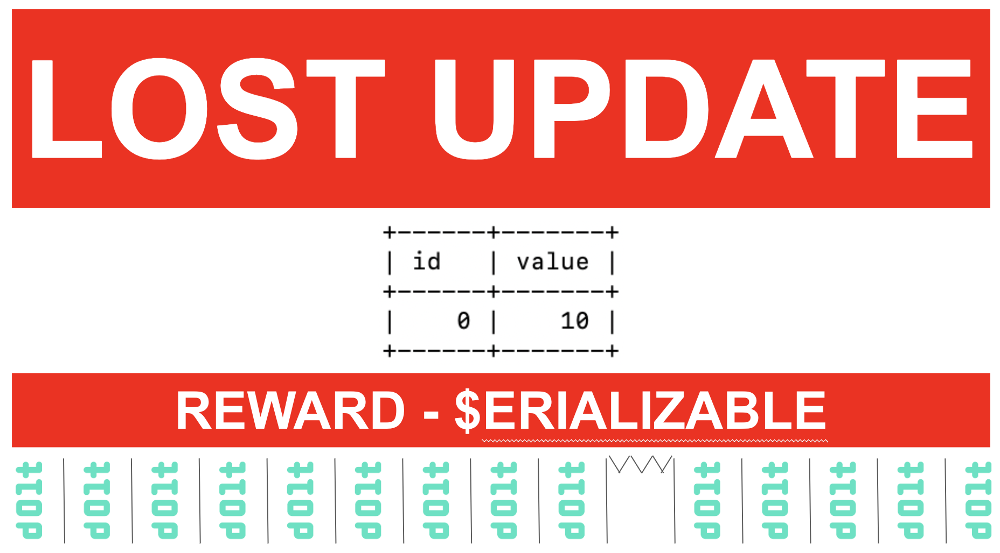

This is the weekly CEO update from [DoltHub](https://www.dolthub.com/). I'm Tim, the CEO of DoltHub. 

As some of you know, here at DoltHub, we [manage by blog post](https://www.dolthub.com/blog/2021-07-02-manage-by-blog-post/). We publish three blogs per week and we've been doing it for four years. That's a lot of blogs! 609 to be exact.

```
ls -a web/packages/blog/src/pages | grep .md | wc -l
     609
```

Well, this week you got treated to [five blogs](https://www.dolthub.com/blog/)! Why? I wrote two extra blogs for the Christmas and New Year's slots but once they were done I thought to myself, "Why hold back?" and published them anyway. It's my gift to you, the reader.

### Making Massive Joins Fast

Our SQL Analyzer is getting pretty good, in some places surpassing MySQL's. One of those places is in massive join performance. Check out [Nick's](https://www.dolthub.com/team#nick) [blog on how we used functional analysis to improve join performance](https://www.dolthub.com/blog/2023-12-13-functional-dependency-analysis/). It's a bit of a deep dive but definitely worth it if your interested in how SQL databases work underneath the covers.

### Update on the EBS Performance Regression

Regular readers may remember we had a [spooky performance regression](https://www.dolthub.com/blog/2023-11-22-spooky-performance-regression-aws-ebs/) in our `sysbench` tests that made us look like we were faster than MySQL for some tests. This had us all in a tizzy.

We [figured it out](https://www.dolthub.com/blog/2023-12-08-christmas-come-early-ebs-performance-regression-update/) with the help of a reader. A helpful reader showed up on [our Discord](https://discord.gg/gqr7K4VNKe) and suggested we use EBS GP3 instead of GP2 and it turns out only GP2 volumes suffered from this performance regression. Problem solved. We're back to 1.7X MySQL on `sysbench` as expected. No free relative performance wins for us.

### Dolt Transaction Concurrency Example

Dolt is more susceptible to the lost update problem because it uses merge logic on transaction commit. Using [a detailed example I show what this means](https://www.dolthub.com/blog/2023-12-14-concurrent-transaction-example/) in your Dolt-powered application. The solution is row level locking. Coming Soon.

Plus, this featured image is some of the best work of my career.

[](https://www.dolthub.com/blog/2023-12-14-concurrent-transaction-example/)

Until next week. As always, just reply to this email if you want to chat.

--Tim