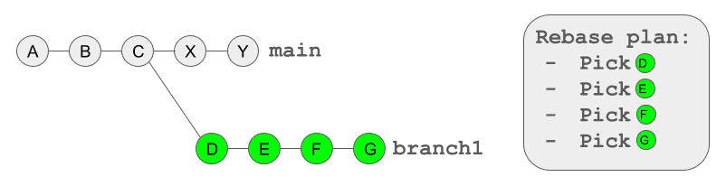

This is the weekly CEO update from [DoltHub](https://www.dolthub.com/). I'm Tim, the CEO of DoltHub. 

Happy new year! Thanks for reading my stupid jokes in 2023. In 2024, expect more of the same lame joke content to kick off this email. If you want funny, watch [Fireship](https://www.youtube.com/watch?v=jb2AvF8XzII&t=128s).

### Rebase is here

2023 was the year of MySQL compatibility. Dolt is up to 99.996% correct on `sqllogictest`. We are at the point where we can usually fix MySQL incompatibilities in less than 24 hours. That means we have time in the schedule to enhance teh feature set that got you interested in Dolt in the first place, the version control.

To kick off 2024, we have to version control enhancements to announce. The first is [rebase](https://www.dolthub.com/blog/2024-01-03-announcing-dolt-rebase/). Rebase is kind of complicated and dangerous but [Jason](https://www.dolthub.com/team#jason) explains it pretty well in his launch blog. 

Rebase allows Dolt users to now clean up a messy commit history or do history compression. More history compression features are planned in 2024. We've heard some potential Dolt users are afraid that storing the entire history of their database online, forever is untenable. We will remove that excuse not to use Dolt in 2024.

### Push to a Running Dolt Server

The second version control enhancement is [pushing to a running server](https://www.dolthub.com/blog/2023-12-29-sql-server-push-support/). Last year we released [the ability to clone and pull via the open remotes port](https://www.dolthub.com/blog/2023-04-17-cloning-a-hosted-database/) on a running Dolt SQL Server so you could use [Hosted Dolt](https://hosted.doltdb.com) as a remote. This feature was great but we didn't support push because, well, concurrency. 

[Neil](https://www.dolthub.com/team#neil) fixed that and released [the ability for a running SQL server to accept pushes](https://www.dolthub.com/blog/2023-12-29-sql-server-push-support/). This allows you to use Hosted Dolt or any other running Dolt database as a collaboration hub as well as a running server. 

### Dolt Workbench Supports Postgres

2024 will also be the year of Doltgres. By the end of 2024 we want Doltgres in the same place compatibility-wise to Postgres as Dolt is to MySQL today. That means most applications will "just work" when connected to Doltgres using the Postgres connector. 

Before then, we [launched Postgres support](https://www.dolthub.com/blog/2023-12-27-dolt-workbench-supports-postgres/) in the [Dolt Workbench](https://github.com/dolthub/dolt-workbench). We think the Dolt Workbench is the [most modern SQL workbench out there](https://www.dolthub.com/blog/2023-12-27-dolt-workbench-supports-postgres/) and we're excited for Postgres users to try it. 

The Dolt Workbench will be the primary user interface to Doltgres as we have no plans right now to support Doltgres databases on DoltHub. Doltgres is a version controlled database. If you want Git for Data functionality like we have on DoltHub, that is what Dolt is for.

Until next week. As always, just reply to this email if you want to chat.

--Tim