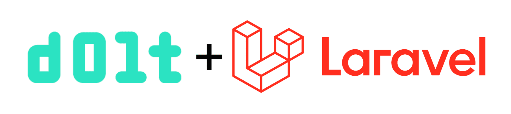

This is the weekly CEO update from [DoltHub](https://www.dolthub.com/). I'm Tim, the CEO of DoltHub. 

{Joke}

### Dolt CLI Progress

In 2023, we worked really hard to make Dolt a [credible OLTP database](https://www.dolthub.com/blog/2023-05-05-dolt-1-dot-0/). Now that we have a handle on SQL, we're back to improving the Git-like qualities of Dolt. Last week, I told you about [the rebase launch](https://www.dolthub.com/blog/2024-01-03-announcing-dolt-rebase/) and [push improvements](https://www.dolthub.com/blog/2023-12-29-sql-server-push-support/). This week, [Stephanie](https://www.dolthub.com/team#stephanie) discusses all the [improvements she's been making to the Dolt CLI and what's next](https://www.dolthub.com/blog/2024-01-05-cli-new-years-resolutions/). If you have any Dolt CLI features you would like, reply to this email.

### Laravel Works with Dolt

We're on a mission to show that Dolt just works with all your favorite tools in all your favorite languages. This week, [the spotlight](https://www.dolthub.com/blog/2024-01-08-dolt-laravel/) is on [PHP](https://www.php.net/) and [Laravel](https://laravel.com/). Laravel is a popular website builder with a built-in ORM called Eloquent. In [this blog](https://www.dolthub.com/blog/2024-01-08-dolt-laravel/), I add branch and merge features to the Laravel bootcamp app, a Twitter...errr....X clone called Chirper. 

[The demo is open source](https://github.com/dolthub/chirper). It's is cool to play with to show how branches and merges can be used to make a [Version Controlled application](https://www.dolthub.com/blog/2024-01-08-version-controlled-application/). 

### Building a Version Controlled Application

Speaking of which, [Zach](https://www.dolthub.com/team#stephanie) wrote [an article](https://www.dolthub.com/blog/2024-01-08-version-controlled-application/) on what a version controlled application is and how to build one with Dolt. If you want to add an audit log, branches, merges, diffs, and pull requests to your application, Dolt is the way.

Until next week. As always, just reply to this email if you want to chat.

--Tim