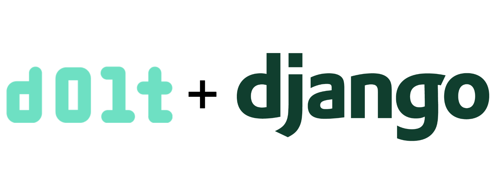

This is the weekly CEO update from [DoltHub](https://www.dolthub.com/). I'm Tim, the CEO of DoltHub. 

Tomorrow, I'm the ripe old age of 44. Palindrome birthdays are the best birthdays. Birthday wishes will be accepted graciously.

### Better MySQL Function Support

MySQL supports [a lot of functions](https://docs.dolthub.com/sql-reference/sql-support/expressions-functions-operators#functions-and-operators). Previously our strategy has been to wait for people to ask before we implement a missing one. We can usually turn around a function in a day or so. 

Recently, we've got more proactive. [James](https://www.dolthub.com/team#james) is [hard wat work](https://www.dolthub.com/blog/2024-01-29-sql-improvement/) implementing functions Dolt is missing, roughly is easiest to hardest order. Please don't hesitate to ask us for functions you need.

### Dolt and Django

We're on a mission to show that Dolt just works with all your favorite tools in all your favorite languages. This week, [the spotlight](https://www.dolthub.com/blog/2024-01-31-dolt-django/) is on [Django](https://www.djangoproject.com/), a popular Python-based website builder with a built-in ORM. 

We had [previously](https://www.dolthub.com/blog/?q=django) made Dolt work with Django for the [Nautobot integration](https://www.dolthub.com/blog/2021-09-24-announcing-nautobot-on-dolt/). For [this blog](https://www.dolthub.com/blog/2024-01-31-dolt-django/), we start at the basics and use Dolt to build branches and merges into the Django administration console. The [sample website source code](https://github.com/dolthub/dolt_django) is also available if you just want to play with it.

### How to Support Us

As a special birthday treat for myself, I'm going to ask for support. Here's a list of ways to support us from cheapest on up.

1. **Free** - Use the product and tell us what you're using it for. Run a Dolt database and share it with your teammates on [DoltHub](https://www.dolthub.com) or [DoltLab](https://www.doltlab.com). Star [our GitHub repo](https://github.com/dolthub/dolt).
2. **Free** - Cut [GitHub Issues](https://github.com/dolthub/dolt/issues) for bugs you find or improvements you want. Come to [our Discord](https://discord.com/invite/RFwfYpu) for live support.
3. **Free** - Tell other people about us. Write a blog or make a Youtube video about Dolt.
3. **Free to start** - Sign up for DoltHub Pro. You'll pay $50/month after you have over 100MB of databases on DoltHub. Unlimited users.
4. **Any Amount** - [GitHub sponsor the DoltHub organization](https://github.com/sponsors/dolthub).
5. **$50/month and up** - Deploy a [Hosted Dolt](https://hosted.doltdb.com) Instance. Power a production workload with it.
6. **$5,000/month** - [Buy support](https://www.dolthub.com/pricing) for Dolt, DoltHub, DoltLab and all our other products. This price is negotiable depending on your support needs.

Until next week. As always, just reply to this email if you want to chat.

--Tim