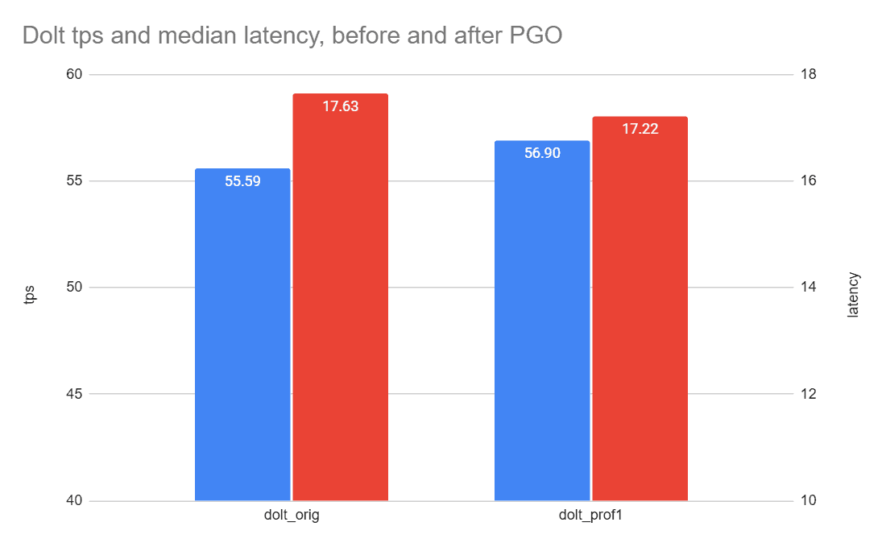

This is the weekly CEO update from [DoltHub](https://www.dolthub.com/). I'm Tim, the CEO of DoltHub. 

We bought some Dolt-branded hoodies. I wore it home and had the following exchange with my 10-year old son:

Son: "You're selling merch now? I want one."
Me: "Dolt means idiot."
Son: "I'm good."

### Test Containers Works With Dolt

We're on a mission to show that Dolt just works with all your favorite tools in all your favorite languages. This week, [the spotlight](https://www.dolthub.com/blog/2024-02-05-testcontainers-for-go-with-dolt/) is on [Test Containers](https://testcontainers.com/), a framework for testing using Docker containers. 

Dolt is useful in testing because you can clone data from DoltHub, run write tests, and reset after every test. We [use this approach to test Dolt itself](https://www.dolthub.com/blog/2022-06-10-enginetest-perf/) and sped up our tests 10X. If you're looking for a non-production Dolt use case and have a MySQL database, consider Dolt as your test database [using Test Containers](https://www.dolthub.com/blog/2024-02-05-testcontainers-for-go-with-dolt/).

### Profile Guided Optimization in Go

We have not one but two [Golang blogs](https://www.dolthub.com/blog/?q=golang) this week. The first [shows how Golang's Profile Guided Optimization](https://www.dolthub.com/blog/2024-02-02-profile-guided-optimization/), PGO for short, sped up Dolt reads by 5%. We're modifying our build process this week to get those speed ups released in production.

### Tags in Go

For our second Go blog, [Brian](https://www.dolthub.com/team#brian) had to get Go tags to work for [Hosted Dolt](https://hosted.doltdb.com). He learned a bunch in the process so he wrote [a great explainer on Go tags](https://www.dolthub.com/blog/2024-02-07-go-tags/) using examples from his work. 

Until next week. As always, just reply to this email if you want to chat.

--Tim